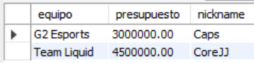
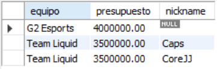
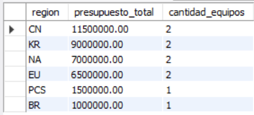

# Ejercicio Avanzado 001 - Transacciones (COMMIT / ROLLBACK)

**Camper:** Antonio Canux

## Descripción

Primer ejercicio de nivel avanzado, enfocado en un módulo de datos para un torneo de esports (MOBA). La base de datos relaciona a los Equipos y sus respectivos Jugadores, asignando un presupuesto a cada organización. El objetivo de esta práctica es implementar **Transacciones (ACID)** para simular de forma segura la compra/transferencia de un jugador entre equipos, asegurando que tanto el descuento de dinero como la asignación del jugador ocurran en bloque, practicando `START TRANSACTION`, `COMMIT` y `ROLLBACK`.

---

## Tablas utilizadas

**avanzado_ejercicio_001_equipos**
- id (PK)
- nombre
- region
- presupuesto
- creado_en

**avanzado_ejercicio_001_jugadores**
- id (PK)
- nickname
- rol
- equipo_id (FK)

---

## Consultas y Transacciones realizadas

### 1. Estado inicial previo a la transferencia (G2 Esports y Team Liquid)

```sql
SELECT e.nombre AS equipo, e.presupuesto, j.nickname 
    FROM avanzado_ejercicio_001_equipos 
    e LEFT JOIN avanzado_ejercicio_001_jugadores 
    j ON e.id = j.equipo_id 
    WHERE e.id IN (3, 6);
```

**Resultado**



---

### 2. TRANSACCIÓN (COMMIT): Compra y transferencia exitosa de un jugador (Caps hacia Team Liquid)

```sql
START TRANSACTION;
UPDATE avanzado_ejercicio_001_equipos 
    SET presupuesto = presupuesto - 1000000 
    WHERE id = 6;
UPDATE avanzado_ejercicio_001_equipos 
    SET presupuesto = presupuesto + 1000000 
    WHERE id = 3;
UPDATE avanzado_ejercicio_001_jugadores 
    SET equipo_id = 6 
    WHERE id = 4;
COMMIT;
```

---

### 3. Verificación de los cambios aplicados permanentemente tras el COMMIT

```sql
SELECT e.nombre AS equipo, e.presupuesto, j.nickname 
    FROM avanzado_ejercicio_001_equipos 
    e LEFT JOIN avanzado_ejercicio_001_jugadores 
    j ON e.id = j.equipo_id 
    WHERE e.id IN (3, 6);
```

**Resultado**



---

### 4. TRANSACCIÓN (ROLLBACK): Intento de transferencia cancelada (Fnatic intenta fichar a Faker pero la transacción se revierte)

```sql
START TRANSACTION;
UPDATE avanzado_ejercicio_001_equipos 
    SET presupuesto = presupuesto - 10000000 
    WHERE id = 4;
UPDATE avanzado_ejercicio_001_equipos 
    SET presupuesto = presupuesto + 10000000 
    WHERE id = 1;
UPDATE avanzado_ejercicio_001_jugadores 
    SET equipo_id = 4 
    WHERE id = 1;
ROLLBACK;
```

---

### 5. Indicador: Presupuesto total de los equipos agrupados por región

```sql
SELECT region, SUM(presupuesto) AS presupuesto_total, COUNT(id) AS cantidad_equipos 
    FROM avanzado_ejercicio_001_equipos 
    GROUP BY region 
    ORDER BY presupuesto_total DESC;
```

**Resultado**



---

## Herramientas

- MySQL
- MySQL Workbench
- Git
- GitHub

---

**Campuslands · Skill SQL**