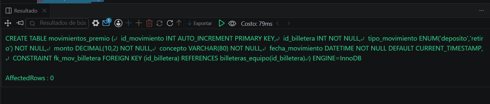
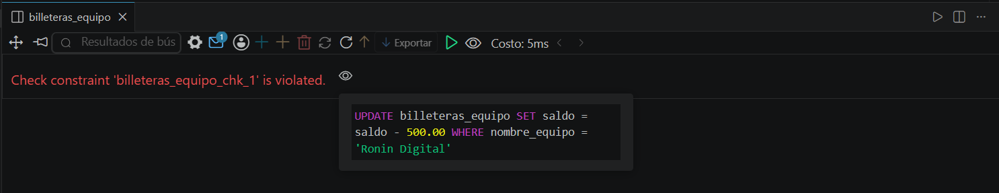
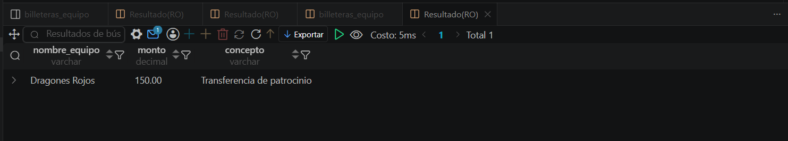

# Resolucion - Ejercicio 001 (Avanzado) - Selvin Lem

## Tematica
Torneo esports MOBA

## Como ejecutar
1. Ejecutar `ddl/schema.sql` para crear billeteras_equipo y movimientos_premio.
2. Ejecutar `dml/inserts.sql`: inserta datos base y corre 2 transacciones
   (una exitosa con COMMIT, una revertida con ROLLBACK).
3. Ejecutar `dql/consultas.sql` para verificar saldos e historial.

## Entidad principal
- Tablas: billeteras_equipo, movimientos_premio (FK a billeteras_equipo)
- Atributos clave: nombre_equipo, saldo, tipo_movimiento, monto

## Restriccion aplicada
CHECK (saldo >= 0) en billeteras_equipo, mas ENGINE=InnoDB requerido
para soportar transacciones.

## Caso limite incluido
Transaccion de retiro que dejaria saldo negativo en equipo congelado;
se revierte con ROLLBACK sin dejar cambios parciales.

## Evidencia ejecucion - schema.sql

````
Caso limite incluido
Transaccion de retiro que intenta dejar saldo negativo en equipo congelado.
El CHECK (saldo >= 0) rechaza el UPDATE antes de aplicarlo (error:
"Check constraint 'billeteras_equipo_chk_1' is violated"), evitando que
el dato se corrompa. El ROLLBACK cierra la transaccion sin cambios
parciales, confirmando que la restriccion protege la integridad real
del dato, no solo su definicion en el schema.
````

 

## Evidencia ejecucion - inserts.sql
 

## Evidencia ejecucion - consultas.sql
 