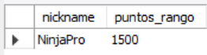
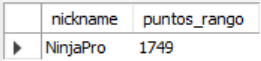
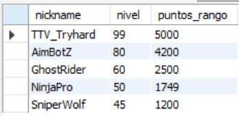

# Ejercicio Avanzado 002 - Procedimientos Almacenados

**Camper:** Antonio Canux

## Descripción

Segundo ejercicio de nivel avanzado, enfocado en un módulo de datos para el ranking de un Battle Royale. Se crearon tablas para llevar el control de los Jugadores y su historial de Partidas. El objetivo principal es construir y ejecutar un **Procedimiento Almacenado (`STORED PROCEDURE`)** que automatice la lógica de negocio: al registrar los resultados de una nueva partida, el procedimiento calcula dinámicamente los puntos obtenidos y actualiza automáticamente el puntaje global del jugador en una sola llamada.

---

## Tablas utilizadas

**avanzado_ejercicio_002_jugadores**
- id (PK)
- nickname
- nivel
- puntos_rango
- creado_en

**avanzado_ejercicio_002_partidas**
- id (PK)
- jugador_id (FK)
- posicion
- eliminaciones
- puntos_obtenidos
- creado_en

---

## Consultas y Procedimientos realizados

### 1. Creación del Procedimiento Almacenado `RegistrarPartidaBattleRoyale`

```sql
DELIMITER //
CREATE PROCEDURE RegistrarPartidaBattleRoyale(IN p_jugador_id INT, IN p_posicion INT, IN p_eliminaciones INT)
BEGIN
  DECLARE v_puntos_calculados INT;
  SET v_puntos_calculados = (p_eliminaciones * 15) + (100 - p_posicion);
  INSERT INTO avanzado_ejercicio_002_partidas (jugador_id, posicion, eliminaciones, puntos_obtenidos) VALUES (p_jugador_id, p_posicion, p_eliminaciones, v_puntos_calculados);
  UPDATE avanzado_ejercicio_002_jugadores SET puntos_rango = puntos_rango + v_puntos_calculados WHERE id = p_jugador_id;
END //
DELIMITER ;
```

---

### 2. ¿Cuál es el estado de los puntos de 'NinjaPro' (ID 1) ANTES de la nueva partida?

```sql
SELECT nickname, puntos_rango 
    FROM avanzado_ejercicio_002_jugadores 
    WHERE id = 1;
```

**Resultado**



---

### 3. Ejecución (`CALL`) del procedimiento: 'NinjaPro' registra un 1er lugar con 10 eliminaciones

```sql
CALL RegistrarPartidaBattleRoyale(1, 1, 10);
```

---

### 4. ¿Cuál es el estado de los puntos de 'NinjaPro' (ID 1) DESPUÉS de la partida?

```sql
SELECT nickname, puntos_rango 
    FROM avanzado_ejercicio_002_jugadores 
    WHERE id = 1;
```

**Resultado**



---

### 5. ¿Cuál es el Top 5 general de jugadores ordenados por su puntaje de rango?

```sql
SELECT nickname, nivel, puntos_rango 
    FROM avanzado_ejercicio_002_jugadores 
    ORDER BY puntos_rango 
    DESC LIMIT 5;
```

**Resultado**



---

## Herramientas

- MySQL
- MySQL Workbench
- Git
- GitHub

---

**Campuslands · Skill SQL**