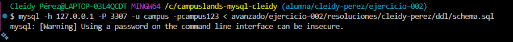
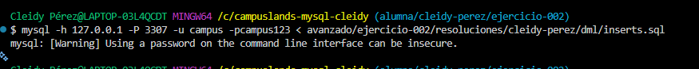
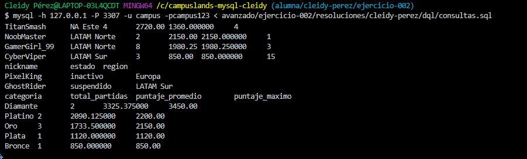

# Ejercicio 002 - Procedimientos Almacenados (Avanzado)

**Estudiante:** Cleidy Pérez  
**Módulo:** MySQL Avanzado  

## 📌 Decisiones Técnicas
1. **Procedimientos Almacenados (`Stored Procedures`):**
   - `sp_registrar_partida`: Automatiza la inserción de partidas y evalúa la lógica de negocio para aumentar el nivel del jugador si logra un puntaje alto ($\ge 2000$).
   - `sp_obtener_ranking_region`: Recibe parámetros dinámicos (`p_region` y `p_top_limit`) para generar reportes del ranking según la región y cantidad de jugadores deseada.
2. **Uso de DELIMITER:** Se utilizó `DELIMITER //` para permitir la declaración multilínea de los procedimientos.
3. **Manejo de Estados y Nulos:** Se integró `COALESCE()` para mostrar `0` en jugadores sin historial.

### Evidencia en la terminal 
-SCHEMA


-INSERTAR


- CONSULTAR



## 🚀 Orden de Ejecución

```bash
# 1. Crear tablas y Procedimientos Almacenados
mysql -h 127.0.0.1 -P 3307 -u campus -pcampus123 < ddl/schema.sql

# 2. Insertar datos de prueba
mysql -h 127.0.0.1 -P 3307 -u campus -pcampus123 < dml/inserts.sql

# 3. Probar SPs y consultas
mysql -h 127.0.0.1 -P 3307 -u campus -pcampus123 < dql/consultas.sql