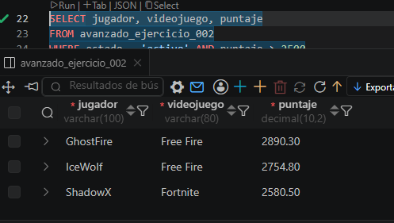

# 🏆 Ranking Battle Royale

## 📖 Descripción

Este proyecto consiste en el desarrollo de un módulo de base de datos para administrar un **Ranking Battle Royale**. El sistema registra información de los jugadores, su videojuego, la cantidad de victorias obtenidas y el puntaje alcanzado durante la competencia.

La finalidad es practicar la creación de tablas, la inserción de registros y la ejecución de consultas SQL que permitan obtener información útil para el análisis del torneo.

---

# 🎯 Objetivo

Una academia técnica está construyendo un módulo de datos inspirado en un **Ranking Battle Royale**. El objetivo es guardar información ordenada, consultar indicadores útiles y dejar scripts SQL fáciles de revisar por otro desarrollador.

---

# 🗄️ Información almacenada

La tabla **ranking_battle_royale** almacena los siguientes datos:

| Campo | Descripción |
|--------|-------------|
| **id** | Identificador único del jugador. |
| **jugador** | Nombre del jugador registrado. |
| **videojuego** | Juego Battle Royale en el que participa. |
| **victorias** | Número total de victorias obtenidas. |
| **puntaje** | Puntaje acumulado dentro del ranking. |
| **estado** | Estado del jugador (`activo`, `suspendido` o `retirado`). |
| **fecha_registro** | Fecha y hora en que se registró el jugador. |

---

# 📝 Actividades realizadas

## 1. Creación de la tabla

Se diseñó una tabla utilizando diferentes tipos de datos (`INT`, `VARCHAR`, `DECIMAL`, `ENUM` y `DATETIME`) para almacenar la información de los jugadores.

Se implementaron restricciones como:

- `PRIMARY KEY`
- `AUTO_INCREMENT`
- `NOT NULL`
- `DEFAULT`

---

## 2. Inserción de datos

Se registraron **10 jugadores** pertenecientes a diferentes videojuegos Battle Royale, incluyendo Fortnite, PUBG, Free Fire y Apex Legends.

Cada registro contiene:

- Nombre del jugador.
- Videojuego.
- Cantidad de victorias.
- Puntaje obtenido.
- Estado del jugador.

---

## 3. Consultas realizadas

Durante el ejercicio se desarrollaron consultas para:

- Mostrar todos los jugadores registrados.
- Consultar únicamente los jugadores activos.
- Filtrar jugadores con más de 35 victorias.
- Ordenar el ranking por puntaje.
- Contar la cantidad de jugadores por videojuego.

---

# 📚 Comandos SQL utilizados

- `CREATE TABLE`
- `INSERT INTO`
- `SELECT`
- `WHERE`
- `ORDER BY`
- `GROUP BY`
- `COUNT`

---

# ✅ Resultado esperado

Al finalizar el ejercicio se obtiene una base de datos capaz de administrar un Ranking Battle Royale, permitiendo consultar estadísticas de los jugadores, organizar la información y generar indicadores básicos mediante consultas SQL.

---

# 🎓 Competencias desarrolladas

Al realizar este ejercicio el estudiante aprenderá a:

- Diseñar tablas en bases de datos relacionales.
- Seleccionar tipos de datos adecuados.
- Insertar múltiples registros.
- Consultar información mediante SQL.
- Filtrar y ordenar datos.
- Utilizar funciones de agregación como `COUNT()`.
- Documentar scripts para facilitar su mantenimiento.

---

# 🚀 Conclusión

Este ejercicio permite aplicar los fundamentos de SQL en un entorno inspirado en los videojuegos Battle Royale. A través de la creación de la tabla, el registro de datos y la ejecución de consultas, se fortalecen las habilidades necesarias para gestionar información de forma organizada, eficiente y comprensible para cualquier desarrollador.

# evidencia

