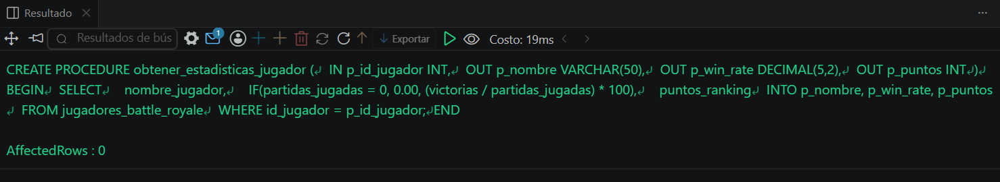
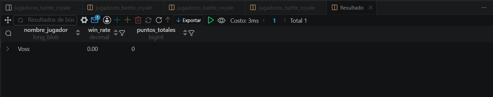

# Resolucion - Ejercicio 002 (Avanzado) - Selvin Lem

## Tematica
Ranking battle royale

## Como ejecutar
1. Ejecutar `ddl/schema.sql`: crea la tabla y los 2 procedimientos.
2. Ejecutar `dml/inserts.sql`: inserta 8 jugadores y simula 6 partidas
   llamando a registrar_resultado_partida.
3. Ejecutar `dql/consultas.sql` para verificar ranking y estadisticas.

## Entidad principal
- Tabla: jugadores_battle_royale
- Procedimientos: registrar_resultado_partida, obtener_estadisticas_jugador

## Restriccion aplicada
Validacion interna en el procedimiento: si el puntaje calculado es
negativo, se fuerza a 0 antes de actualizar el ranking.

## Caso limite incluido
Jugador que muere en posicion 20 con 0 kills; el calculo daria puntaje
negativo, pero el procedimiento lo normaliza a 0.

## Evidencia ejecucion - schema.sql

 

## Evidencia ejecucion - consultas.sql
 