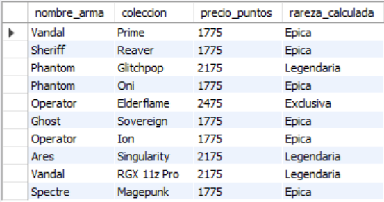
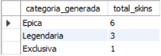
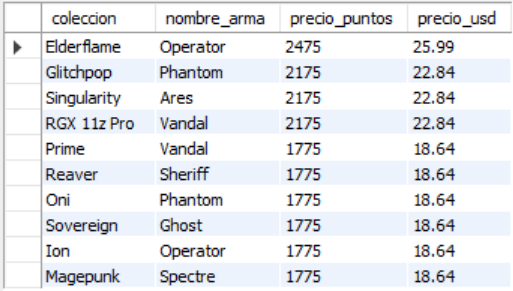

# Ejercicio Avanzado 003 - Funciones (UDF)

**Camper:** Antonio Canux

## Descripción

Tercer ejercicio de nivel avanzado, estructurado sobre un módulo de datos para un inventario de skins de shooter (organizado por Colecciones y Armas). El objetivo de esta práctica es implementar **Funciones definidas por el usuario (UDF - User Defined Functions)** para modularizar la lógica de negocio directamente en la base de datos, como la categorización dinámica de rarezas y la conversión de moneda virtual a dinero real.

---

## Tablas utilizadas

**avanzado_ejercicio_003_colecciones**
- id (PK)
- nombre
- tematica
- creado_en

**avanzado_ejercicio_003_skins**
- id (PK)
- coleccion_id (FK)
- nombre_arma
- precio_puntos

---

## Consultas y Funciones realizadas

### 1. Creación de la función `CategorizarPrecioSkin`

```sql
DELIMITER //
CREATE FUNCTION CategorizarPrecioSkin(p_precio INT) RETURNS VARCHAR(20)
DETERMINISTIC
BEGIN
  DECLARE v_categoria VARCHAR(20);
  IF p_precio >= 2475 THEN SET v_categoria = 'Exclusiva';
  ELSEIF p_precio >= 2175 THEN SET v_categoria = 'Legendaria';
  ELSEIF p_precio >= 1775 THEN SET v_categoria = 'Epica';
  ELSE SET v_categoria = 'Estandar';
  END IF;
  RETURN v_categoria;
END //
DELIMITER ;
```

---

### 2. ¿Cuál es el listado de skins con su rareza calculada dinámicamente mediante la función?

```sql
SELECT s.nombre_arma, c.nombre AS coleccion, s.precio_puntos, CategorizarPrecioSkin(s.precio_puntos) AS rareza_calculada 
    FROM avanzado_ejercicio_003_skins 
    s JOIN avanzado_ejercicio_003_colecciones 
    c ON s.coleccion_id = c.id;
```

**Resultado**



---

### 3. ¿Cuántas skins tenemos en el inventario agrupadas por la categoría generada por la función?

```sql
SELECT CategorizarPrecioSkin(precio_puntos) AS categoria_generada, COUNT(*) AS total_skins 
    FROM avanzado_ejercicio_003_skins 
    GROUP BY categoria_generada 
    ORDER BY total_skins DESC;
```

**Resultado**



---

### 4. Creación de la función `ConvertirPuntosAUSD` para tasar el inventario en dinero real

```sql
DELIMITER //
CREATE FUNCTION ConvertirPuntosAUSD(p_precio INT) RETURNS DECIMAL(10,2)
DETERMINISTIC
BEGIN
  RETURN ROUND(p_precio * 0.0105, 2);
END //
DELIMITER ;
```

---

### 5. ¿Cuál es el valor convertido en dólares (USD) para cada skin utilizando la segunda función?

```sql
SELECT c.nombre AS coleccion, s.nombre_arma, s.precio_puntos, ConvertirPuntosAUSD(s.precio_puntos) AS precio_usd 
    FROM avanzado_ejercicio_003_skins 
    s JOIN avanzado_ejercicio_003_colecciones 
    c ON s.coleccion_id = c.id 
    ORDER BY precio_usd DESC;
```

**Resultado**



---

## Herramientas

- MySQL
- MySQL Workbench
- Git
- GitHub

---

**Campuslands · Skill SQL**