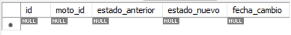
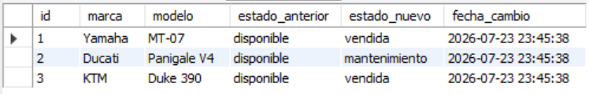
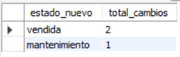

# Ejercicio Avanzado 004 - Triggers

**Camper:** Antonio Canux

## Descripción

Cuarto ejercicio de nivel avanzado, aplicado a un módulo de datos de un garaje de motos. La solución consta de una tabla principal de vehículos y una tabla secundaria de auditoría. El objetivo principal es implementar **Triggers (Disparadores)** en MySQL para automatizar el seguimiento de cambios (historial): cada vez que una motocicleta cambia de estado (ej. de 'disponible' a 'vendida'), el Trigger inserta automáticamente un registro detallado en la tabla de auditoría.

---

## Tablas utilizadas

**avanzado_ejercicio_004_motos**
- id (PK)
- marca
- modelo
- precio
- estado
- creado_en

**avanzado_ejercicio_004_auditoria**
- id (PK)
- moto_id (FK)
- estado_anterior
- estado_nuevo
- fecha_cambio

---

## Consultas y Triggers realizados

### 1. Creación del Trigger `trg_auditoria_estado_moto`

```sql
DELIMITER //
CREATE TRIGGER trg_auditoria_estado_moto
AFTER UPDATE ON avanzado_ejercicio_004_motos
FOR EACH ROW
BEGIN
  IF OLD.estado != NEW.estado THEN
    INSERT INTO avanzado_ejercicio_004_auditoria (moto_id, estado_anterior, estado_nuevo) VALUES (NEW.id, OLD.estado, NEW.estado);
  END IF;
END //
DELIMITER ;
```

---

### 2. ¿Cuál es el estado inicial de la tabla de auditoría previo a cualquier modificación?

```sql
SELECT * FROM avanzado_ejercicio_004_auditoria;
```

**Resultado**



---

### 3. Ejecución de operaciones `UPDATE` para disparar el Trigger

```sql
UPDATE avanzado_ejercicio_004_motos 
    SET estado = 'vendida' 
    WHERE id = 1;
UPDATE avanzado_ejercicio_004_motos 
    SET estado = 'mantenimiento' 
    WHERE id = 5;
UPDATE avanzado_ejercicio_004_motos 
    SET estado = 'vendida' 
    WHERE id = 7;
```

---

### 4. ¿Qué registros se generaron automáticamente en la tabla de auditoría tras los cambios?

```sql
SELECT a.id, m.marca, m.modelo, a.estado_anterior, a.estado_nuevo, a.fecha_cambio 
    FROM avanzado_ejercicio_004_auditoria 
    a JOIN avanzado_ejercicio_004_motos 
    m ON a.moto_id = m.id;
```

**Resultado**



---

### 5. ¿Cuántos cambios de estado se han registrado agrupados por el nuevo estado asignado?

```sql
SELECT estado_nuevo, COUNT(*) AS total_cambios 
    FROM avanzado_ejercicio_004_auditoria 
    GROUP BY estado_nuevo 
    ORDER BY total_cambios DESC;
```

**Resultado**



---

## Herramientas

- MySQL
- MySQL Workbench
- Git
- GitHub

---

**Campuslands · Skill SQL**