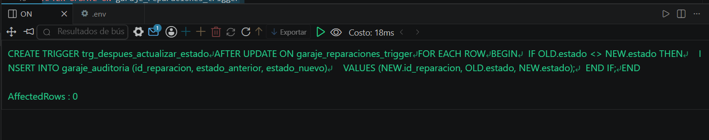
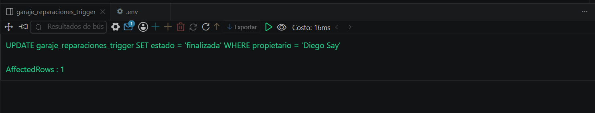
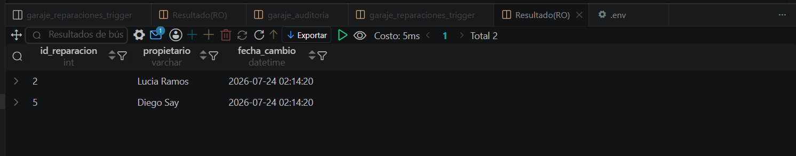

# Resolucion - Ejercicio 004 (Avanzado) - Selvin Lem

## Tematica
Garaje de motos

## Como ejecutar
1. Ejecutar `ddl/schema.sql`: crea las tablas y los 2 triggers.
2. Ejecutar `dml/inserts.sql`: inserta 8 reparaciones y aplica 4 UPDATE
   que disparan el trigger de auditoria.
3. Ejecutar `dql/consultas.sql` para verificar datos y auditoria.

## Entidad principal
- Tablas: garaje_reparaciones_trigger, garaje_auditoria (generada por trigger)
- Triggers: trg_antes_insertar_reparacion (BEFORE INSERT),
  trg_despues_actualizar_estado (AFTER UPDATE)

## Restriccion aplicada
El trigger BEFORE INSERT normaliza costos negativos a 0.00 antes
de guardar el registro.

## Caso limite incluido
Reparacion insertada con costo -50.00; el trigger lo corrige a 0.00
automaticamente sin intervencion manual.

## Evidencia ejecucion - schema.sql

 

## Evidencia ejecucion - inserts.sql
 

## Evidencia ejecucion - consultas.sql
 