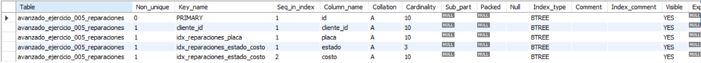
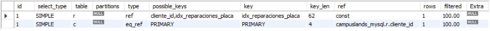
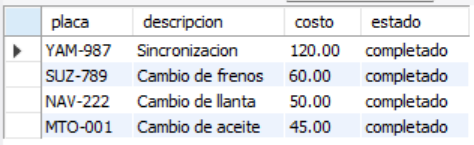

# Ejercicio Avanzado 005 - Índices (INDEX & EXPLAIN)

**Camper:** Antonio Canux

## Descripción

Quinto y último ejercicio de nivel avanzado, aplicado a un módulo de datos para un taller mecánico de motos. La práctica se centra en la optimización del rendimiento de la base de datos mediante la creación de **Índices (`INDEX`)**. Además, se utiliza el comando `EXPLAIN` para verificar objetivamente que el motor de MySQL está utilizando los índices creados al ejecutar las consultas, demostrando un criterio técnico profesional para manejar grandes volúmenes de datos en el futuro.

---

## Tablas utilizadas

**avanzado_ejercicio_005_clientes**
- id (PK)
- documento (UNIQUE INDEX por defecto)
- nombre
- telefono
- creado_en

**avanzado_ejercicio_005_reparaciones**
- id (PK)
- cliente_id (FK)
- placa (INDEX simple)
- descripcion
- costo (Usado en INDEX compuesto)
- estado (Usado en INDEX compuesto)

---

## Consultas y Optimizaciones realizadas

### 1. ¿Cuáles son los índices actualmente registrados en la tabla de reparaciones?

```sql
SHOW INDEX FROM avanzado_ejercicio_005_reparaciones;
```

**Resultado**



---

### 2. Búsqueda directa de una motocicleta específica por su placa (aprovechando el índice)

```sql
SELECT r.placa, r.descripcion, c.nombre 
    FROM avanzado_ejercicio_005_reparaciones 
    r JOIN avanzado_ejercicio_005_clientes c ON r.cliente_id = c.id 
    WHERE r.placa = 'BMW-654';
```

**Resultado**


---

### 3. Evidencia técnica (`EXPLAIN`): Comprobación de que el motor utiliza `idx_reparaciones_placa`

```sql
EXPLAIN SELECT r.placa, r.descripcion, c.nombre 
    FROM avanzado_ejercicio_005_reparaciones 
    r JOIN avanzado_ejercicio_005_clientes c ON r.cliente_id = c.id 
    WHERE r.placa = 'BMW-654';
```

**Resultado**



---

### 4. Filtrado y ordenamiento optimizado aprovechando el índice compuesto (`estado` + `costo`)

```sql
SELECT placa, descripcion, costo, estado 
    FROM avanzado_ejercicio_005_reparaciones 
    WHERE estado = 'completado' 
    ORDER BY costo DESC;
```

**Resultado**



---

### 5. Evidencia técnica (`EXPLAIN`): Comprobación de que el motor utiliza `idx_reparaciones_estado_costo` para filtrar y ordenar sin *filesort* extra

```sql
EXPLAIN SELECT placa, descripcion, costo, estado 
    FROM avanzado_ejercicio_005_reparaciones 
    WHERE estado = 'completado' 
    ORDER BY costo DESC;
```

**Resultado**


---

## Herramientas

- MySQL
- MySQL Workbench
- Git
- GitHub

---

**Campuslands · Skill SQL**