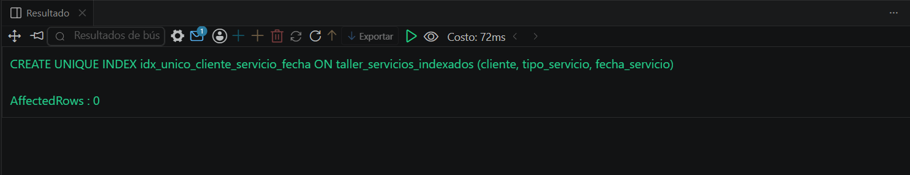
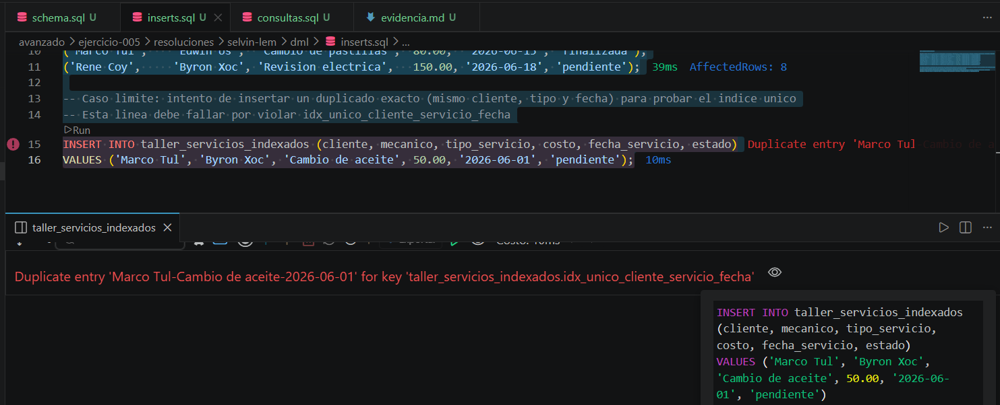
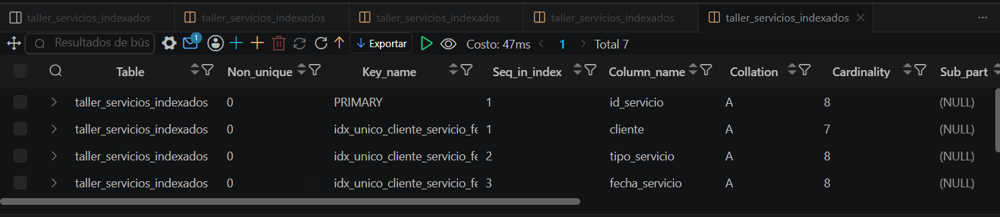

# Resolucion - Ejercicio 005 (Avanzado) - Selvin Lem

## Tematica
Taller mecanico de motos

## Como ejecutar
1. Ejecutar `ddl/schema.sql`: crea la tabla y 3 indices (simple,
   compuesto y unico).
2. Ejecutar `dml/inserts.sql`: inserta 8 registros; el ultimo INSERT
   debe fallar por violar el indice unico (caso limite esperado).
3. Ejecutar `dql/consultas.sql`: incluye EXPLAIN para verificar uso
   real de los indices.

## Entidad principal
- Tabla: taller_servicios_indexados
- Indices: idx_mecanico (simple), idx_estado_fecha (compuesto),
  idx_unico_cliente_servicio_fecha (unico)

## Restriccion aplicada
Indice UNIQUE sobre (cliente, tipo_servicio, fecha_servicio), evita
duplicar el mismo servicio para el mismo cliente en la misma fecha.

## Caso limite incluido
Intento de INSERT duplicado exacto; MySQL lo rechaza con error
"Duplicate entry" por el indice unico, evidencia esperada del error.

## Evidencia ejecucion - schema.sql

 

## Evidencia ejecucion - inserts.sql

````
Intento de INSERT duplicado exacto (Marco Tul, Cambio de aceite, 2026-06-01).
MySQL lo rechaza con: "Duplicate entry 'Marco Tul-Cambio de aceite-2026-06-01'
for key 'taller_servicios_indexados.idx_unico_cliente_servicio_fecha'". Los
primeros 8 registros validos se insertaron correctamente (AffectedRows: 8);
solo el noveno, construido a proposito como duplicado, fue rechazado.
````

 

## Evidencia ejecucion - consultas.sql
 