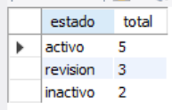
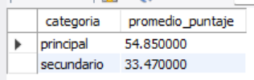
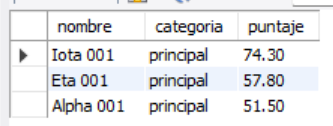
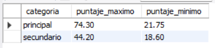
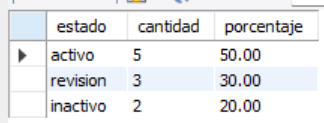

# Ejercicio 001 - Consultas SQL Básicas

**Camper:** Antonio Canux

## Descripción

Ejercicio realizado para practicar consultas básicas en MySQL utilizando una tabla con datos de ejemplo.

---

## Tabla utilizada

**basico_ejercicio_001**

Campos:

- id
- nombre
- categoria
- puntaje
- estado
- fecha_creacion

---

## Consultas realizadas

### 1. ¿Cuántos registros existen por estado?

```sql
SELECT estado, COUNT(*) AS total
FROM basico_ejercicio_001
GROUP BY estado;
```

**Resultado**



---

### 2. ¿Cuál es el puntaje promedio por categoría?

```sql
SELECT categoria, AVG(puntaje) AS promedio_puntaje
FROM basico_ejercicio_001
GROUP BY categoria;
```

**Resultado**



---

### 3. ¿Qué registros activos tienen un puntaje mayor a 50?

```sql
SELECT nombre, categoria, puntaje
FROM basico_ejercicio_001
WHERE estado = 'activo'
  AND puntaje > 50
ORDER BY puntaje DESC;
```

**Resultado**



---

### 4. ¿Cuál es el puntaje máximo y mínimo por categoría?

```sql
SELECT categoria,
       MAX(puntaje) AS puntaje_maximo,
       MIN(puntaje) AS puntaje_minimo
FROM basico_ejercicio_001
GROUP BY categoria;
```

**Resultado**



---

### 5. ¿Qué porcentaje del total representa cada estado?

```sql
SELECT estado,
       COUNT(*) AS cantidad,
       ROUND(COUNT(*) * 100.0 / (SELECT COUNT(*) FROM basico_ejercicio_001), 2) AS porcentaje
FROM basico_ejercicio_001
GROUP BY estado;
```

**Resultado**



---

## Herramientas

- MySQL
- MySQL Workbench
- Git
- GitHub

---

**Campuslands · Skill SQL**