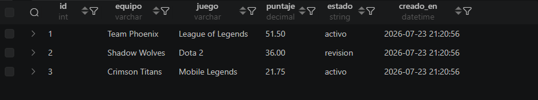

## EJERCICIO 001

# Descripción
Una academia tecnica esta construyendo un modulo de datos inspirado en torneo esports MOBA. El objetivo es guardar informacion ordenada, consultar indicadores utiles y dejar scripts SQL faciles de revisar por otro desarrollador.

# Desarrollo.

Durante el trabajo se trabajaron de acuerdo a las especificaciones requeridad, como la creación de las tablas, la insesion de datos y la consulta de las mismas.

## EVIDENCIAS
