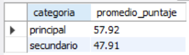
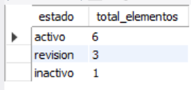
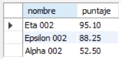
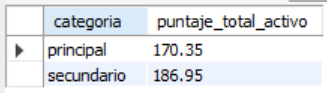
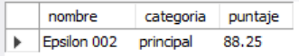

# Ejercicio 002 - Consultas SQL Básicas

**Camper:** Antonio Canux

## Descripción

Ejercicio enfocado en la resolución de preguntas de negocio mediante consultas de agregación, filtrado y ordenamiento en MySQL, utilizando datos sintéticos generados para la tabla de trabajo.

---

## Tabla utilizada

**basico_ejercicio_002**

Campos:

- id
- nombre
- categoria
- puntaje
- estado
- fecha_creacion

---

## Consultas realizadas

### 1. ¿Cuál es el puntaje promedio por cada categoría?

```sql
SELECT categoria, ROUND(AVG(puntaje), 2) AS promedio_puntaje 
	FROM basico_ejercicio_002 
	GROUP BY categoria;
```

**Resultado**



---

### 2. ¿Cuántos elementos se encuentran en cada estado operativo?

```sql
SELECT estado, COUNT(*) AS total_elementos 
    FROM basico_ejercicio_002 
    GROUP BY estado 
    ORDER BY total_elementos DESC;
```

**Resultado**



---

### 3. ¿Cuáles son los elementos "principales" con alto rendimiento (puntaje mayor a 50)?

```sql
SELECT nombre, puntaje 
    FROM basico_ejercicio_002 
    WHERE categoria = 'principal' AND puntaje > 50.00 
    ORDER BY puntaje DESC;
```

**Resultado**



---

### 4. ¿Cuál es la suma total de los puntajes de los elementos que están actualmente "activos", desglosado por categoría?

```sql
SELECT categoria, SUM(puntaje) AS puntaje_total_activo 
    FROM basico_ejercicio_002 
    WHERE estado = 'activo' 
    GROUP BY categoria;
```

**Resultado**



---

### 5. ¿Cuál es el elemento en estado de "revisión" que tiene el puntaje más alto?

```sql
SELECT nombre, categoria, puntaje 
    FROM basico_ejercicio_002 
    WHERE estado = 'revision' 
    ORDER BY puntaje DESC 
    LIMIT 1;
```

**Resultado**



---

## Herramientas

- MySQL
- MySQL Workbench
- Git
- GitHub

---

**Campuslands · Skill SQL**