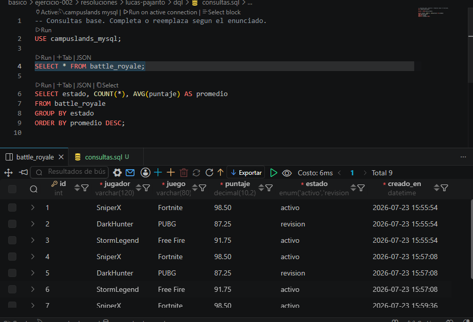

## EJERCICIO 002

## DESCRIPCION
Una academia tecnica esta construyendo un modulo de datos inspirado en ranking battle royale. El objetivo es guardar informacion ordenada, consultar indicadores utiles y dejar scripts SQL faciles de revisar por otro desarrollador.

## DESARROLLLO

Durante el desarrollo de este ejercicio se creo una tabla pra crear el ranking de puntuaciones de un juego de battle royale.

## EVIDENCIA

