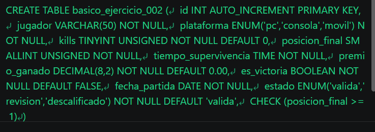
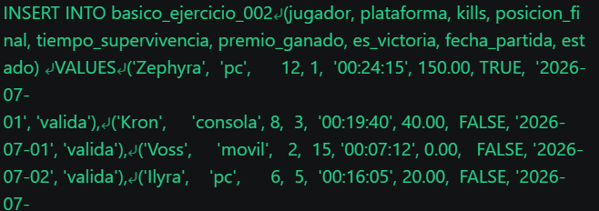
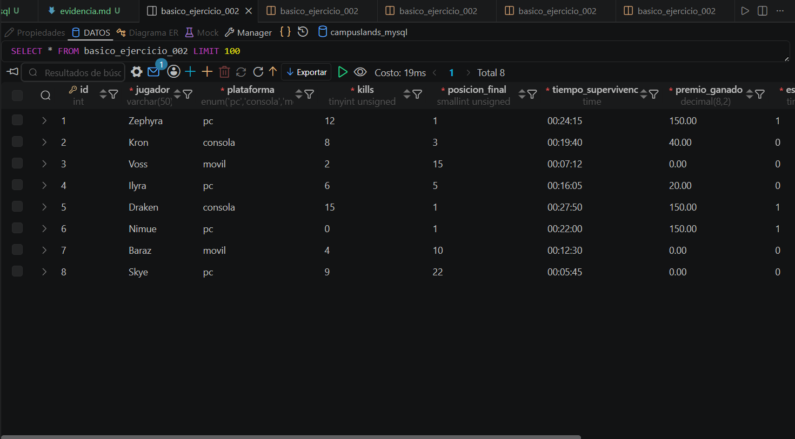

# Resolucion - Ejercicio 002 - Selvin Lem

## Tematica
Ranking battle royale

## Como ejecutar
1. Ejecutar `ddl/schema.sql` para crear basico_ejercicio_002.
2. Ejecutar `dml/inserts.sql` para insertar 8 registros de prueba.
3. Ejecutar `dql/consultas.sql` para correr las 5 consultas de validacion.

## Entidad principal
- Tabla: basico_ejercicio_002
- Atributos clave: jugador, kills, posicion_final, es_victoria

## Restriccion aplicada
ENUM en plataforma/estado, mas CHECK (posicion_final >= 1).

## Caso limite incluido
Nimue gana la partida con 0 kills, en estado revision.

## Evidencia ejecucion - schema.sql

 

## Evidencia ejecucion - inserts.sql
 

## Evidencia ejecucion - consultas.sql
 
