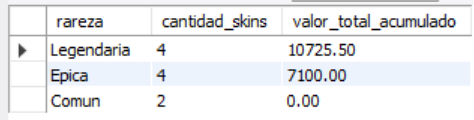
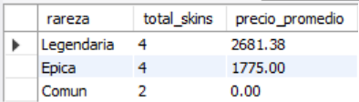
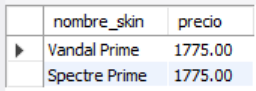
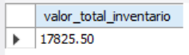
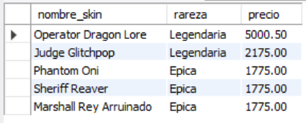

# Ejercicio 003 - Consultas SQL Básicas

**Camper:** Antonio Canux

## Descripción

Ejercicio enfocado en la creación de un módulo de datos inspirado en un inventario de skins de un juego shooter. El objetivo es guardar información estructurada, consultar indicadores de negocio útiles sobre el valor de los artículos, y generar scripts SQL limpios para el repositorio.

---

## Tabla utilizada

**basico_ejercicio_003**

Campos:

- id
- nombre_skin
- rareza
- precio
- estado_uso
- creado_en

---

## Consultas realizadas

### 1. ¿Cuál es el valor total acumulado y la cantidad de skins por cada nivel de rareza?

```sql
SELECT rareza, COUNT(id) AS cantidad_skins, SUM(precio) AS valor_total_acumulado
    FROM basico_ejercicio_003
    GROUP BY rareza
    ORDER BY valor_total_acumulado DESC;
```

**Resultado**



---

### 2. ¿Cuál es la cantidad de skins y el precio promedio por rareza?

```sql
SELECT rareza, COUNT(*) AS total_skins, ROUND(AVG(precio), 2) AS precio_promedio
    FROM basico_ejercicio_003
    GROUP BY rareza
    ORDER BY precio_promedio DESC;
```

**Resultado**



---

### 3. ¿Qué skins legendarias tenemos equipadas actualmente?

```sql
SELECT nombre_skin, precio 
    FROM basico_ejercicio_003 
    WHERE rareza = 'Legendaria' AND estado_uso = 'equipado';
```

**Resultado**



---

### 4. ¿Cuál es el valor total del inventario (skins activas en la cuenta)?

```sql
SELECT SUM(precio) AS valor_total_inventario 
    FROM basico_ejercicio_003 
    WHERE estado_uso IN ('equipado', 'inventario');
```

**Resultado**



---

### 5. ¿Cuáles son las skins en inventario ordenadas de mayor a menor precio?

```sql
SELECT nombre_skin, rareza, precio 
    FROM basico_ejercicio_003 
    WHERE estado_uso = 'inventario'
    ORDER BY precio DESC;
```

**Resultado**



---

## Herramientas

- MySQL
- MySQL Workbench
- Git
- GitHub

---

**Campuslands · Skill SQL**