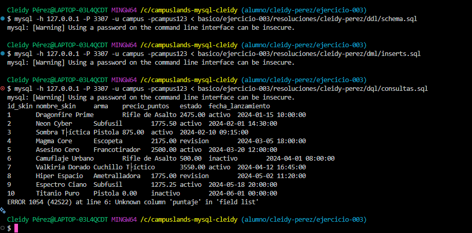

# Resolución Ejercicio 003 
- skins shooter

## 🛠️ Decisiones Técnicas1. 
**Estructura de la Tabla (`jugadores`)**:   
- `estado`: Se empleó el tipo `ENUM` para restringir únicamente a las 5 posiciones estándar de los juegos MOBA   2. 
**Diseño de Consultas**:  
- Se incluyeron alias legibles para reportes de negocio.   
- Se calcularon variables derivadas como el 
**porcentaje de victoria (Winrate)** y agrupaciones por rol y estado.---

## EVIDENCIA


## 🚀 Orden de EjecuciónLos scripts deben ejecutarse secuencialmente en el siguiente orden:

```bash# 1. 
Crear esquema y tablas
mysql -u campus -pcampus123 campuslands_mysql < ddl/schema.sql
# 2. Insertar registros de pruebamysql -u campus -pcampus123 campuslands_mysql < dml/inserts.sql
# 3. Ejecutar consultasmysql -u campus -pcampus123 campuslands_mysql < dql/consultas.sql
