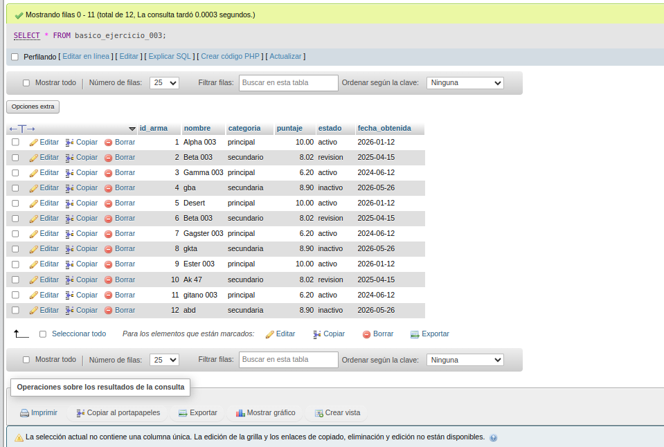
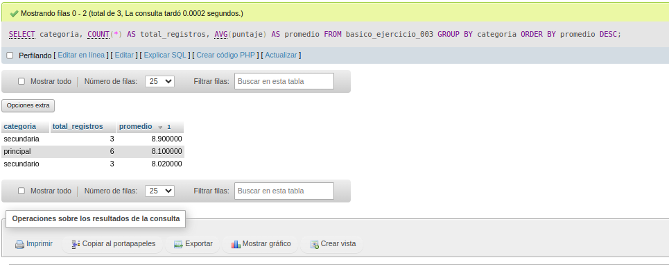

# Ejercicio 003 - PRIMARY KEY en MySQL

## Descripción

Este ejercicio tiene como objetivo practicar el uso de **PRIMARY KEY** en MySQL mediante la creación de una tabla que almacena información de un inventario de armas. Además, se refuerzan conceptos básicos como la creación de bases de datos, inserción de registros y consultas utilizando funciones de agregación.

---

## Objetivos

Al completar este ejercicio serás capaz de:

* Crear una base de datos en MySQL.
* Crear una tabla utilizando `PRIMARY KEY`.
* Utilizar `AUTO_INCREMENT` para generar identificadores únicos.
* Definir tipos de datos adecuados para cada columna.
* Insertar múltiples registros en una tabla.
* Consultar información utilizando funciones de agregación.
* Agrupar y ordenar resultados mediante `GROUP BY` y `ORDER BY`.

---

## Estructura de la tabla

La tabla **basico_ejercicio_003** almacena información sobre armas disponibles en un inventario.

| Campo          | Tipo de dato  | Descripción                                          |
| -------------- | ------------- | ---------------------------------------------------- |
| id_arma        | INT           | Identificador único de cada arma (PRIMARY KEY).      |
| nombre         | VARCHAR(120)  | Nombre del arma.                                     |
| categoria      | VARCHAR(80)   | Categoría a la que pertenece el arma.                |
| puntaje        | DECIMAL(10,2) | Puntaje asignado al arma.                            |
| estado         | ENUM          | Estado del arma (`activo`, `revision` o `inactivo`). |
| fecha_obtenida | DATE          | Fecha en que el arma fue obtenida.                   |

---

## Explicación del script

### 1. Creación de la base de datos

```sql
CREATE DATABASE IF NOT EXISTS campuslands_mysql;
USE campuslands_mysql;
```

Se crea la base de datos únicamente si aún no existe y posteriormente se selecciona para trabajar sobre ella.

---

### 2. Eliminación de la tabla

```sql
DROP TABLE IF EXISTS basico_ejercicio_003;
```

Elimina la tabla si ya existe para evitar errores al ejecutar nuevamente el script.

---

### 3. Creación de la tabla

```sql
CREATE TABLE basico_ejercicio_003 (
    id_arma INT AUTO_INCREMENT PRIMARY KEY,
    nombre VARCHAR(120) NOT NULL,
    categoria VARCHAR(80) NOT NULL,
    puntaje DECIMAL(10,2) NOT NULL DEFAULT 0,
    estado ENUM('activo','revision','inactivo') NOT NULL DEFAULT 'activo',
    fecha_obtenida DATE NOT NULL
);
```

En esta sección se crea la tabla definiendo cada columna y sus restricciones.

El campo **id_arma** utiliza dos características importantes:

* **PRIMARY KEY:** garantiza que cada registro tenga un identificador único.
* **AUTO_INCREMENT:** genera automáticamente un nuevo identificador para cada registro insertado.

---

### 4. Inserción de datos

Se insertan doce registros para representar diferentes armas, categorías, estados y puntajes.

Estos datos permiten realizar consultas utilizando filtros, agrupaciones y funciones de agregación.

---

### 5. Consulta general

```sql
SELECT * FROM basico_ejercicio_003;
```

Muestra todos los registros almacenados en la tabla.

---

### 6. Consulta de análisis

```sql
SELECT categoria,
       COUNT(*) AS total_registros,
       AVG(puntaje) AS promedio
FROM basico_ejercicio_003
GROUP BY categoria
ORDER BY promedio DESC;
```

Esta consulta permite conocer:

* La cantidad de armas registradas por categoría.
* El puntaje promedio de cada categoría.
* El orden de las categorías según su promedio de puntaje.

---

## Conceptos practicados

* `CREATE DATABASE`
* `USE`
* `DROP TABLE IF EXISTS`
* `CREATE TABLE`
* `PRIMARY KEY`
* `AUTO_INCREMENT`
* `NOT NULL`
* `DEFAULT`
* `ENUM`
* `INSERT INTO`
* `SELECT`
* `COUNT()`
* `AVG()`
* `GROUP BY`
* `ORDER BY`

---

## Resultado esperado

Al ejecutar el script correctamente se obtiene:

* Una base de datos llamada **campuslands_mysql**.
* Una tabla llamada **basico_ejercicio_003**.
* Doce registros almacenados.
* Consultas que permiten visualizar todos los datos y obtener estadísticas por categoría.

---

## Orden de ejecución

1. Ejecutar el script de creación de la base de datos y la tabla.
2. Insertar los registros.
3. Ejecutar las consultas de validación.

---

## Conclusión

Este ejercicio introduce el uso de **PRIMARY KEY**, una de las restricciones más importantes en bases de datos relacionales. Gracias a ella, cada arma posee un identificador único que facilita su consulta, actualización y eliminación, manteniendo la integridad de la información almacenada. Además, el ejercicio permite practicar consultas básicas y funciones de agregación que serán fundamentales en ejercicios posteriores.

## evidencia:

Tabla:
    

Consultas:
    s