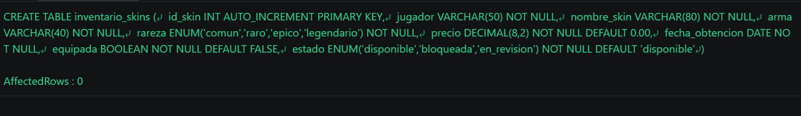
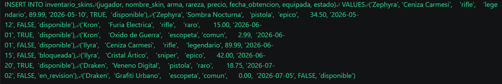
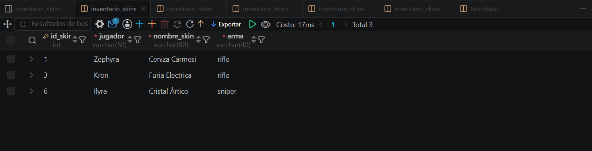

# Resolucion - Ejercicio 003 - Selvin Lem

## Tematica
Inventario de skins shooter

## Como ejecutar
1. Ejecutar `ddl/schema.sql` para crear inventario_skins.
2. Ejecutar `dml/inserts.sql` para insertar 8 registros de prueba.
3. Ejecutar `dql/consultas.sql` para correr las 5 consultas de validacion.

## Entidad principal
- Tabla: inventario_skins
- Atributos clave: id_skin (PK), jugador, nombre_skin, precio

## Restriccion aplicada
PRIMARY KEY autoincremental en id_skin, mas ENUM en rareza y estado.

## Caso limite incluido
Skin con mismo nombre repetido entre dos jugadores distintos,
diferenciados solo por id_skin (demuestra unicidad de la PK).

## Evidencia ejecucion - schema.sql

 

## Evidencia ejecucion - inserts.sql
 

## Evidencia ejecucion - consultas.sql
 

