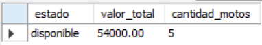
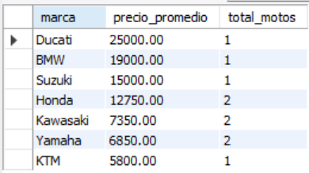
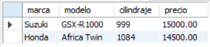
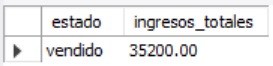
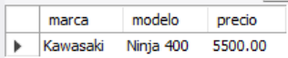

# Ejercicio 004 - Consultas SQL Básicas

**Camper:** Antonio Canux

## Descripción

Ejercicio enfocado en la creación de un módulo de datos inspirado en un garaje de motos. El objetivo es almacenar información estructurada sobre los vehículos y consultar indicadores de negocio útiles.

---

## Tabla utilizada

**basico_ejercicio_004**

Campos:

- id
- marca
- modelo
- cilindraje
- precio
- estado
- creado_en

---

## Consultas realizadas

### 1. ¿Cuál es el valor total y la cantidad del inventario disponible?

```sql
SELECT estado, SUM(precio) AS valor_total, COUNT(id) AS cantidad_motos 
    FROM basico_ejercicio_004 
    WHERE estado = 'disponible' 
    GROUP BY estado;
```

**Resultado**



---

### 2. ¿Cuál es el precio promedio de motocicletas por marca?

```sql
SELECT marca, ROUND(AVG(precio), 2) AS precio_promedio, COUNT(*) AS total_motos 
    FROM basico_ejercicio_004 
    GROUP BY marca 
    ORDER BY precio_promedio DESC;
```

**Resultado**



---

### 3. ¿Qué motos de alto cilindraje (mayor a 600cc) se encuentran en mantenimiento?

```sql
SELECT marca, modelo, cilindraje, precio 
    FROM basico_ejercicio_004 
    WHERE estado = 'mantenimiento' AND cilindraje > 600;
```

**Resultado**



---

### 4. ¿Cuáles son los ingresos totales generados por motos vendidas?

```sql
SELECT estado, SUM(precio) AS ingresos_totales 
    FROM basico_ejercicio_004 
    WHERE estado = 'vendido' GROUP BY estado;
```

**Resultado**



---

### 5. ¿Cuál es la motocicleta de menor precio que está actualmente disponible?

```sql
SELECT marca, modelo, precio 
    FROM basico_ejercicio_004 
    WHERE estado = 'disponible' 
    ORDER BY precio ASC LIMIT 1;
```

**Resultado**



---

## Herramientas

- MySQL
- MySQL Workbench
- Git
- GitHub

---

**Campuslands · Skill SQL**