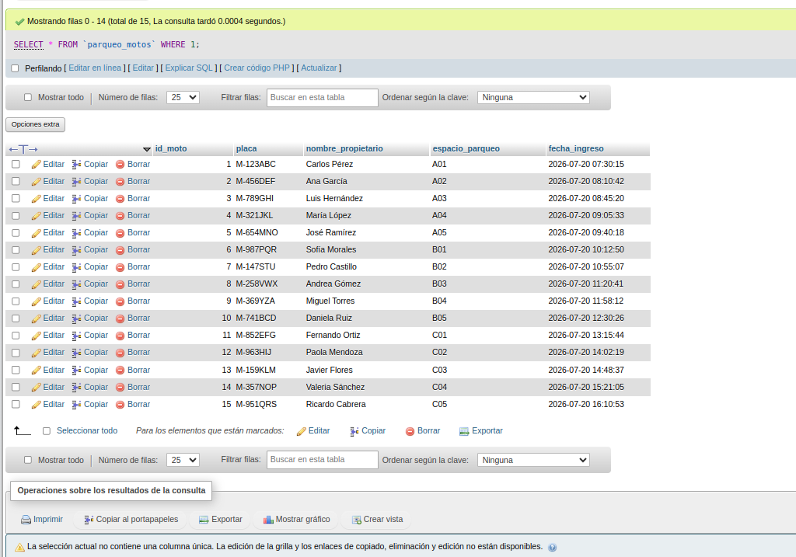
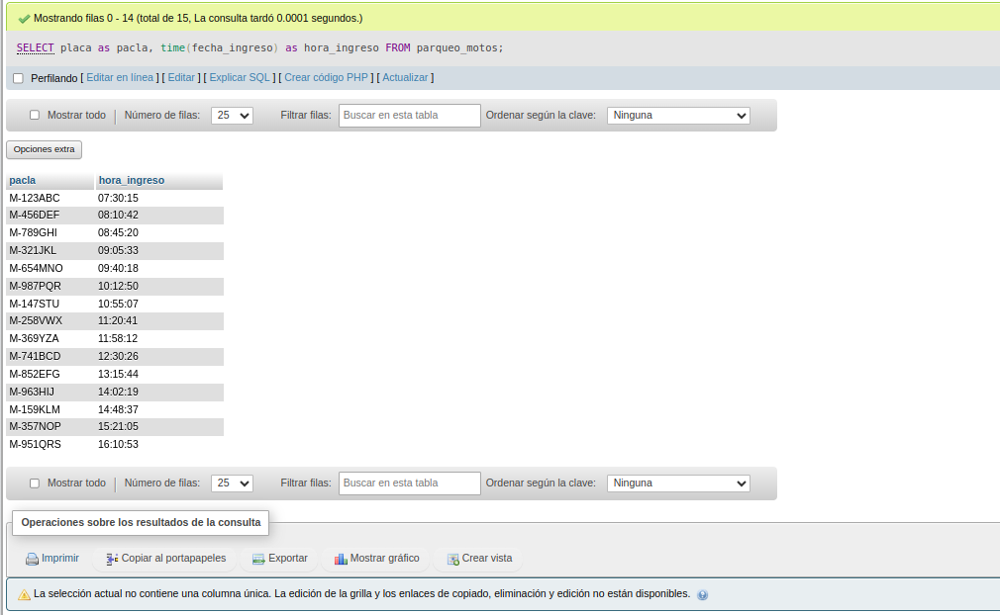
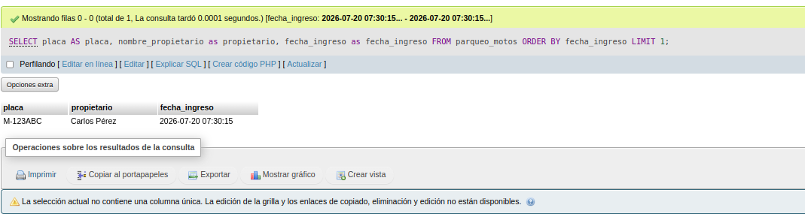
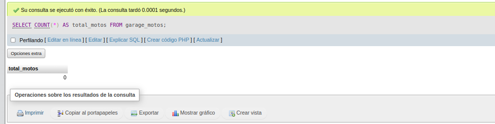
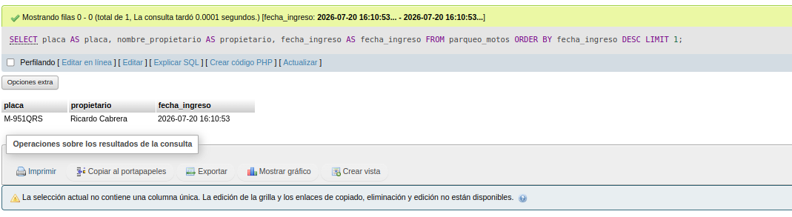

# Ejercicio 004 - AUTO_INCREMENT y PRIMARY KEY

## Descripción

Este ejercicio consiste en desarrollar un sistema básico para el registro de motocicletas en un garage utilizando MySQL.

Se implementa una tabla llamada **parqueo_motos**, donde cada motocicleta posee un identificador único generado automáticamente mediante `AUTO_INCREMENT` y definido como `PRIMARY KEY`.

Además, se registran datos como la placa, el propietario, el espacio de parqueo y la fecha de ingreso.

---

## Objetivos

- Practicar el uso de `PRIMARY KEY`.
- Utilizar `AUTO_INCREMENT` para generar identificadores automáticos.
- Crear una tabla con restricciones (`NOT NULL` y `UNIQUE`).
- Insertar registros de prueba.
- Realizar consultas básicas sobre la información almacenada.

---

## Estructura de la tabla

| Campo | Tipo | Descripción |
|--------|------|-------------|
| id_moto | INT | Identificador único de la motocicleta. |
| placa | VARCHAR(50) | Placa de la motocicleta. |
| nombre_propietario | VARCHAR(60) | Nombre del propietario. |
| espacio_parqueo | VARCHAR(50) | Espacio asignado en el garage. |
| fecha_ingreso | DATETIME | Fecha y hora en que ingresó la motocicleta. |

---

## Restricciones utilizadas

- **PRIMARY KEY** para identificar cada motocicleta.
- **AUTO_INCREMENT** para generar el identificador automáticamente.
- **NOT NULL** para evitar datos vacíos.
- **UNIQUE** para impedir que dos motocicletas ocupen el mismo espacio de parqueo.

---

## Datos utilizados

Se registraron **15 motocicletas** con información ficticia para simular el funcionamiento de un garage.

---

## Consultas realizadas

1. Mostrar todas las motocicletas registradas.
2. Contar el total de motocicletas.
3. Ordenar las motocicletas por espacio de parqueo.
4. Mostrar la última motocicleta que ingresó.
5. Mostrar la primera motocicleta que ingresó.
6. Mostrar únicamente la hora de ingreso.
7. Buscar una motocicleta por su placa.

---

## Orden de ejecución

1. Ejecutar `ddl/schema.sql`.
2. Ejecutar `dml/inserts.sql`.
3. Ejecutar `dql/consultas.sql`.
4. Descripcion `README.md`.

---

## Conceptos practicados

- CREATE DATABASE
- CREATE TABLE
- PRIMARY KEY
- AUTO_INCREMENT
- NOT NULL
- UNIQUE
- INSERT INTO
- SELECT
- WHERE
- ORDER BY
- LIMIT
- COUNT()
- TIME()
- LIKE

Este ejercicio permite comprender cómo crear una tabla con un identificador único automático y realizar consultas básicas sobre un sistema de registro de motocicletas.

## EVIDENCIAS DE CONSULTTAS:
**TOTAL ELEMENTOS**

**HORA INGRESO**

**ORDENAR POR ESPACIO**

**PRIMERA MOTO REGISTRADA**

**TOTAL MOTOS PARQUEADAS**

**ULTIMA MOTOS**S
