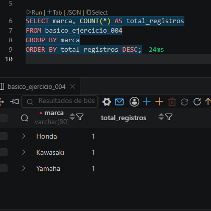

# 📥 Inserción de Datos en SQL

## 📖 Descripción

La instrucción `INSERT INTO` se utiliza para agregar nuevos registros a una tabla de una base de datos. Cada registro corresponde a una fila y debe contener información que coincida con la estructura definida al crear la tabla.

---

# 🛠 Sintaxis

```sql
INSERT INTO nombre_tabla (columna1, columna2, columna3)
VALUES (valor1, valor2, valor3);
```

### Componentes

- **INSERT INTO**: Indica que se agregará información a una tabla.
- **nombre_tabla**: Nombre de la tabla donde se almacenarán los datos.
- **(columna1, columna2, ...)**: Columnas que recibirán los valores.
- **VALUES**: Contiene los datos que serán insertados.

---

# 📌 Ejemplo

Tabla:

```sql
CREATE TABLE motos (
    id INT AUTO_INCREMENT PRIMARY KEY,
    nombre_moto VARCHAR(120),
    marca VARCHAR(80),
    precio DECIMAL(10,2),
    estado ENUM('activo','revision','inactivo')
);
```

Inserción:

```sql
INSERT INTO motos (nombre_moto, marca, precio, estado)
VALUES
('CBR 600RR', 'Honda', 125000.00, 'activo'),
('Ninja ZX-6R', 'Kawasaki', 132500.00, 'revision'),
('YZF-R6', 'Yamaha', 128900.00, 'activo');
```

---

# 🔄 Proceso de Inserción

## 1. Crear la tabla

Antes de insertar datos, la tabla debe existir en la base de datos.

```sql
CREATE TABLE ...
```

---

## 2. Identificar las columnas

Seleccionar las columnas donde se almacenará la información.

```sql
(nombre_moto, marca, precio, estado)
```

---

## 3. Escribir los valores

Los datos deben respetar el tipo de dato definido para cada columna.

```sql
('CBR 600RR', 'Honda', 125000.00, 'activo')
```

---

## 4. Ejecutar la consulta

Al ejecutar el comando SQL, los registros serán almacenados en la tabla.

---

## 5. Verificar la inserción

Se recomienda consultar la tabla para confirmar que los datos fueron guardados correctamente.

```sql
SELECT * FROM motos;
```

---

# ⚠ Buenas Prácticas

- Especificar siempre las columnas al utilizar `INSERT INTO`.
- Verificar que el tipo de dato coincida con el definido en la tabla.
- Insertar varios registros en una sola consulta para mejorar el rendimiento.
- Evitar duplicados cuando existan restricciones de unicidad.
- Comprobar la información con un `SELECT` después de la inserción.

---

# ✅ Resultado Esperado

Después de ejecutar el `INSERT`, la tabla contendrá nuevos registros disponibles para consultas, actualizaciones o eliminación mediante otras instrucciones SQL.

---

# 📚 Comandos Relacionados

| Comando | Función |
|----------|---------|
| `INSERT INTO` | Agrega nuevos registros. |
| `SELECT` | Consulta la información almacenada. |
| `UPDATE` | Modifica registros existentes. |
| `DELETE` | Elimina registros. |
| `TRUNCATE` | Elimina todos los registros de una tabla. |

---

## 🎯 Objetivo

Aprender a utilizar la sentencia **INSERT INTO** para almacenar información en una base de datos relacional, respetando la estructura de la tabla y las restricciones definidas en su diseño.

## Evidencia
