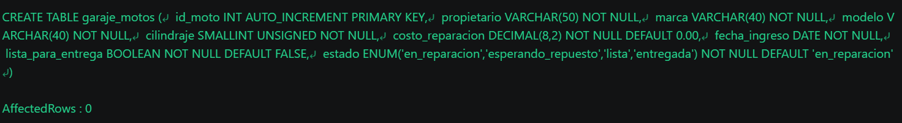
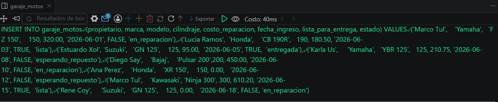
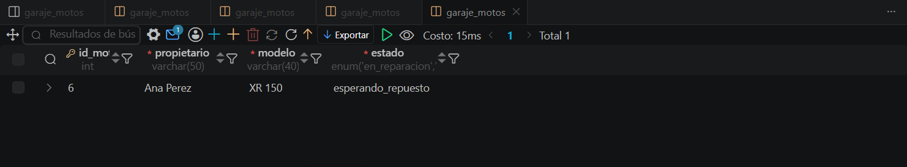

# Resolucion - Ejercicio 004 - Selvin Lem

## Tematica
Garaje de motos

## Como ejecutar
1. Ejecutar `ddl/schema.sql` para crear garaje_motos.
2. Ejecutar `dml/inserts.sql` para insertar 8 registros de prueba.
3. Ejecutar `dql/consultas.sql` para correr las 5 consultas de validacion.

## Entidad principal
- Tabla: garaje_motos
- Atributos clave: propietario, marca, modelo, costo_reparacion

## Restriccion aplicada
ENUM en estado, restringido a valores validos del ciclo de reparacion.

## Caso limite incluido
Moto con costo_reparacion en 0.00 mientras espera repuesto,
sin cotizacion aun asignada.

## Evidencia ejecucion - schema.sql

 

## Evidencia ejecucion - inserts.sql
 

## Evidencia ejecucion - consultas.sql
 