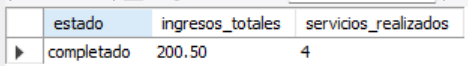
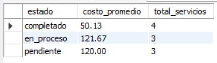
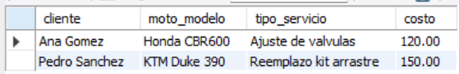
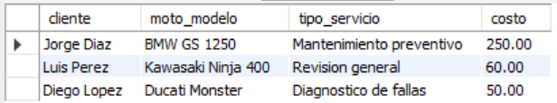
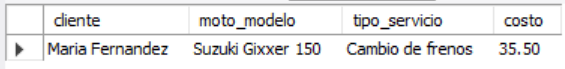

# Ejercicio 005 - Consultas SQL Básicas

**Camper:** Antonio Canux

## Descripción

Ejercicio enfocado en la creación de un módulo de datos inspirado en un taller mecánico de motos. El objetivo es almacenar información estructurada sobre los servicios, clientes y vehículos, y consultar indicadores de negocio útiles.

---

## Tabla utilizada

**basico_ejercicio_005**

Campos:

- id
- cliente
- moto_modelo
- tipo_servicio
- costo
- estado
- creado_en

---

## Consultas realizadas

### 1. ¿Cuáles son los ingresos totales por servicios completados?

```sql
SELECT estado, SUM(costo) AS ingresos_totales, COUNT(id) AS servicios_realizados 
    FROM basico_ejercicio_005 
    WHERE estado = 'completado' 
    GROUP BY estado;
```

**Resultado**



---

### 2. ¿Cuál es el costo promedio y la cantidad de servicios por estado de reparación?

```sql
SELECT estado, ROUND(AVG(costo), 2) AS costo_promedio, COUNT(*) AS total_servicios 
    FROM basico_ejercicio_005 
    GROUP BY estado 
    ORDER BY total_servicios DESC;
```

**Resultado**



---

### 3. ¿Qué servicios en proceso tienen un costo superior a 100?

```sql
SELECT cliente, moto_modelo, tipo_servicio, costo 
    FROM basico_ejercicio_005 
    WHERE estado = 'en_proceso' AND costo > 100;
```

**Resultado**



---

### 4. ¿Cuáles son los servicios pendientes, ordenados de mayor a menor costo?

```sql
SELECT cliente, moto_modelo, tipo_servicio, costo 
    FROM basico_ejercicio_005 
    WHERE estado = 'pendiente' 
    ORDER BY costo DESC;
```

**Resultado**



---

### 5. ¿Cuál es el servicio completado de menor costo?

```sql
SELECT cliente, moto_modelo, tipo_servicio, costo 
    FROM basico_ejercicio_005 
    WHERE estado = 'completado' 
    ORDER BY costo ASC 
    LIMIT 1;
```

**Resultado**



---

## Herramientas

- MySQL
- MySQL Workbench
- Git
- GitHub

---

**Campuslands · Skill SQL**