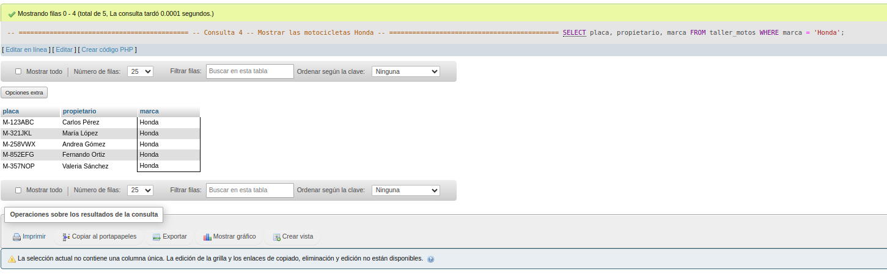
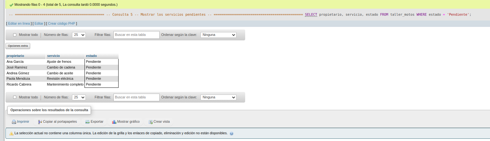
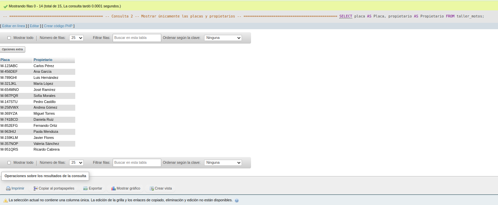
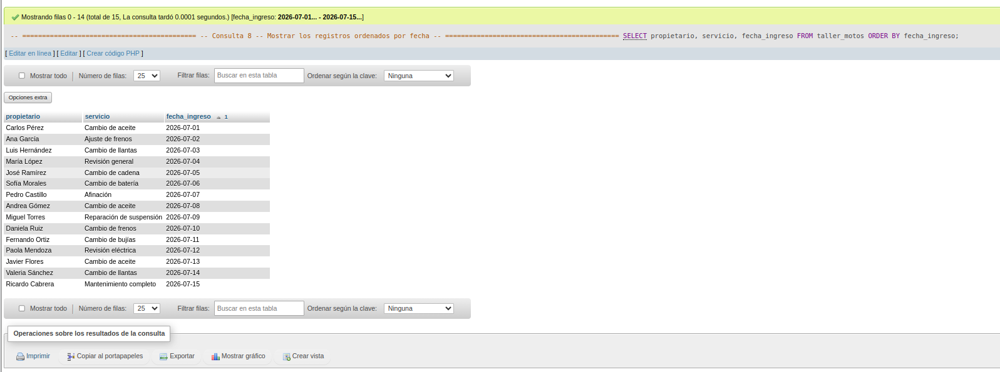
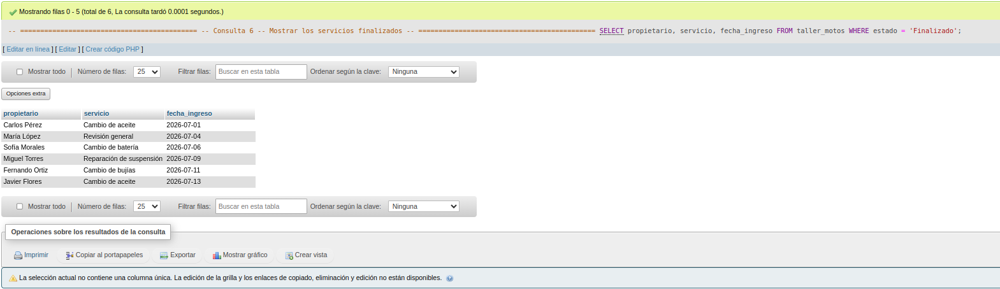
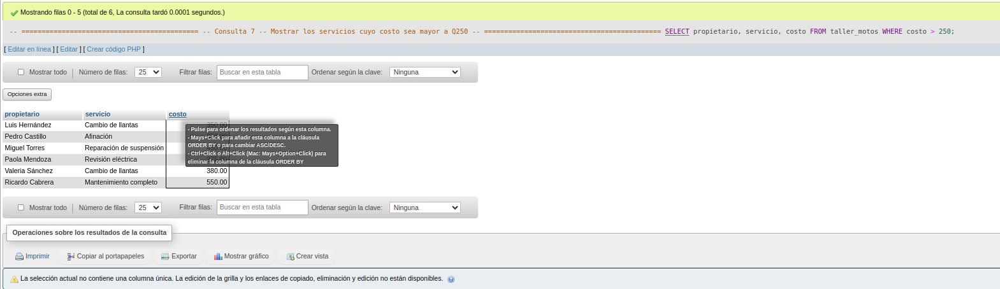
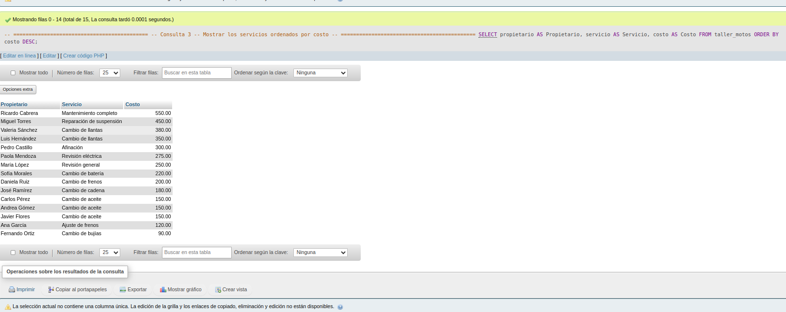
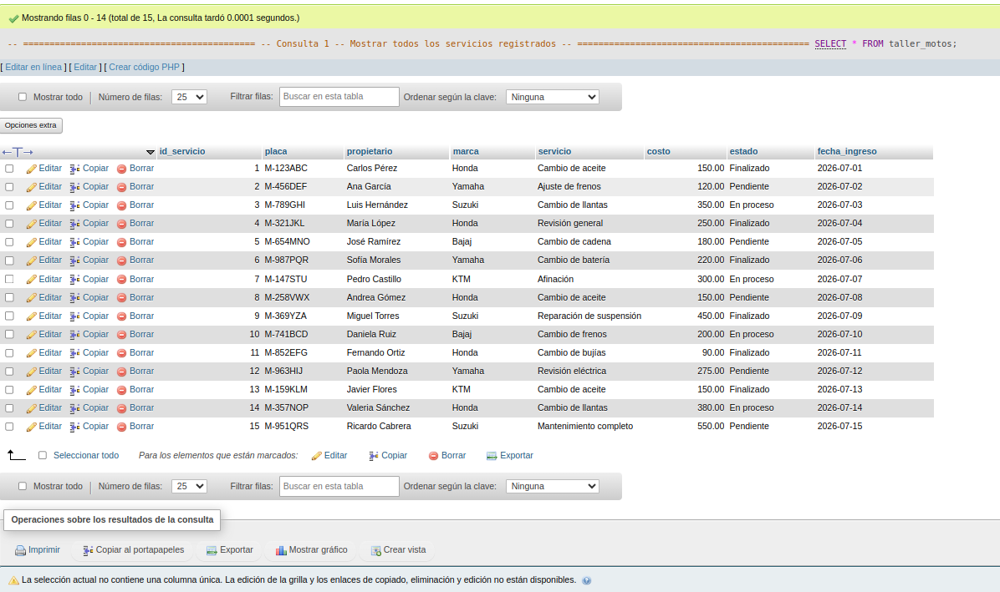

# Ejercicio 005 - SELECT en MySQL

## Descripción

Este ejercicio tiene como objetivo practicar el uso de la sentencia **SELECT** mediante el desarrollo de un sistema básico para un taller mecánico de motocicletas.

La base de datos almacena información sobre los servicios realizados a diferentes motocicletas, permitiendo consultar registros específicos mediante filtros, ordenamientos y selección de columnas.

---

## Objetivos

- Practicar consultas utilizando `SELECT`.
- Seleccionar columnas específicas de una tabla.
- Utilizar alias (`AS`) para mejorar la presentación de los resultados.
- Filtrar información mediante `WHERE`.
- Ordenar registros utilizando `ORDER BY`.

---

## Estructura de la tabla

| Campo | Tipo | Descripción |
|--------|------|-------------|
| id_servicio | INT | Identificador único del servicio. |
| placa | VARCHAR(20) | Placa de la motocicleta. |
| propietario | VARCHAR(60) | Nombre del propietario. |
| marca | VARCHAR(40) | Marca de la motocicleta. |
| servicio | VARCHAR(80) | Tipo de servicio realizado. |
| costo | DECIMAL(8,2) | Costo del servicio. |
| estado | ENUM | Estado del servicio (Pendiente, En proceso o Finalizado). |
| fecha_ingreso | DATE | Fecha en que ingresó la motocicleta al taller. |

---

## Datos registrados

Se insertaron **15 registros** correspondientes a diferentes motocicletas, marcas y servicios, permitiendo realizar consultas variadas.

---

## Consultas realizadas

1. Mostrar todos los servicios registrados.
2. Mostrar únicamente las placas y propietarios.
3. Ordenar los servicios por costo.
4. Mostrar únicamente las motocicletas de la marca Honda.
5. Consultar los servicios pendientes.
6. Consultar los servicios finalizados.
7. Mostrar los servicios con costo superior a Q250.
8. Ordenar los registros por fecha de ingreso.

---

## Orden de ejecución

1. Ejecutar `ddl/schema.sql`.
2. Ejecutar `dml/inserts.sql`.
3. Ejecutar `dql/consultas.sql`.

---

## Conceptos practicados

- CREATE DATABASE
- CREATE TABLE
- INSERT INTO
- SELECT
- WHERE
- ORDER BY
- Alias (`AS`)
- ENUM
- DECIMAL

Este ejercicio fortalece el uso de la sentencia **SELECT**, permitiendo recuperar información específica de una tabla mediante filtros, ordenamientos y selección de columnas, habilidades fundamentales para consultar datos en MySQL.

## Evidencias

**MOSTRAR MOTOS HONDAS**

**MOSTRAR SERVICIOS PENDIENTES**

**MOTOS POR PLACAS Y PROPIETARIOS**

**REGISTRAR POR FECHA**

**SERVICIOS FINALIZADOS**

**MOSTRAR SERVICIOS MAYORES A 250**

**MOSTRAR SERVICIOS POR COSTOS**

**MOSTRAR SERVICIOS REGISTRADOS**
