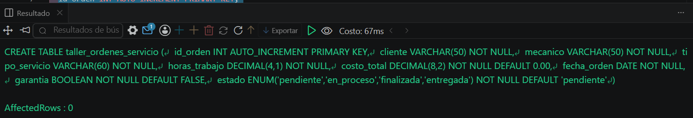
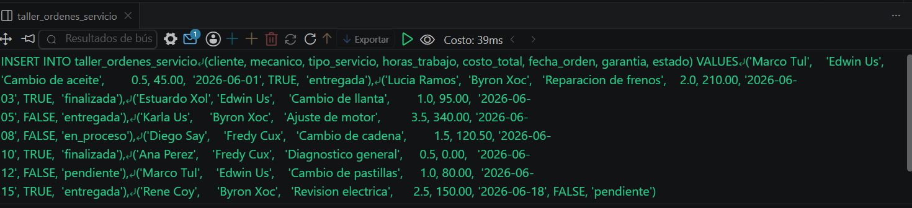
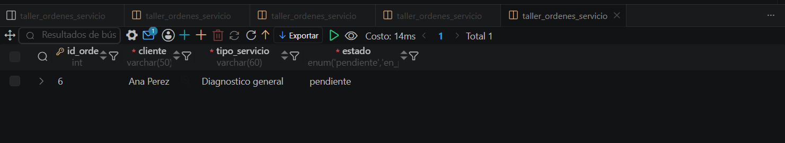

# Resolucion - Ejercicio 005 - Selvin Lem

## Tematica
Taller mecanico de motos

## Como ejecutar
1. Ejecutar `ddl/schema.sql` para crear taller_ordenes_servicio.
2. Ejecutar `dml/inserts.sql` para insertar 8 registros de prueba.
3. Ejecutar `dql/consultas.sql` para correr las 5 consultas de validacion.

## Entidad principal
- Tabla: taller_ordenes_servicio
- Atributos clave: cliente, mecanico, tipo_servicio, costo_total

## Restriccion aplicada
ENUM en estado, restringido al ciclo de vida de una orden de servicio.

## Caso limite incluido
Orden pendiente con costo_total en 0.00, diagnostico aun sin cotizar.

## Evidencia ejecucion - schema.sql

 

## Evidencia ejecucion - inserts.sql
 

## Evidencia ejecucion - consultas.sql
 