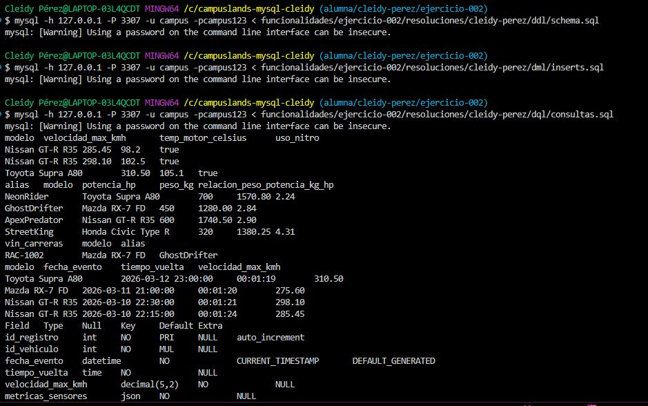

# Funcionalidad 002 - Tipos de Datos en MySQL

**Estudiante:** Cleidy Pérez  
**Temática:** Carreras Urbanas (*Street Racing*)  
**Módulo:** Funcionalidades Aplicadas de MySQL  

---

## 🏎️ ¿Qué es y qué problema resuelve?

La elección adecuada de los **Tipos de Datos** en MySQL previene problemas de:
1. **Desperdicio de Almacenamiento:** Usar `VARCHAR(255)` para datos fijos o de tamaño reducido incrementa la memoria consumida.
2. **Pérdida de Precisión Numérica:** Usar `FLOAT` o `DOUBLE` para pesos o métricas exactas produce errores de redondeo por representación binaria flotante.
3. **Rigidez de Esquemas:** Campos dinámicos (como sensores telemétricos) requerirían decenas de columnas `NULL`. Al usar `JSON` se permite flexibilidad sin modificar el DDL.

---

## 🛠️ Tipos de Datos Aplicados en la Solución

| Tipo de Dato | Columna | Justificación Técnica |
| :--- | :--- | :--- |
| **`INT UNSIGNED`** | `potencia_hp` | Un caballo de fuerza no puede ser negativo; omitir el signo duplica el rango positivo. |
| **`CHAR(8)`** | `vin_carreras` | Código alfanumérico único de longitud fija de 8 caracteres (`RAC-XXXX`). Ocupa exactamente 8 bytes estáticos, optimizando búsquedas. |
| **`DECIMAL(6,2)`** | `peso_kg` | Garantiza precisión numérica exacta hasta con 2 decimales sin errores de coma flotante. |
| **`ENUM(...)`** | `categoria` | Restringe el campo a valores permitidos (*Amateur, Pro, Leyenda*) optimizando espacio internamente como entero. |
| **`DATETIME` & `TIME`**| `fecha_evento`, `tiempo_vuelta` | Permite ordenamientos cronológicos nativos y filtros por intervalos de tiempo. |
| **`JSON`** | `metricas_sensores` | Almacena estructuras dinámicas (presión de llantas, temperatura del motor, nitro) consultables nativamente con `->>`. |

---

### Evidencia 


## 🚀 Orden de Ejecución en Terminal

```bash
# 1. Crear las tablas y restricciones (DDL)
mysql -h 127.0.0.1 -P 3307 -u campus -pcampus123 < ddl/schema.sql

# 2. Cargar los datos de prueba (DML)
mysql -h 127.0.0.1 -P 3307 -u campus -pcampus123 < dml/inserts.sql

# 3. Ejecutar las consultas de validación (DQL)
mysql -h 127.0.0.1 -P 3307 -u campus -pcampus123 < dql/consultas.sql