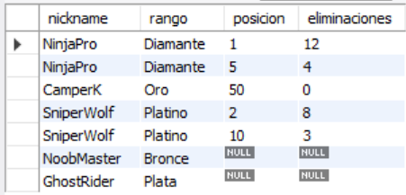
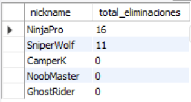
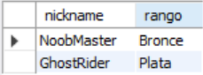
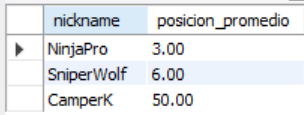
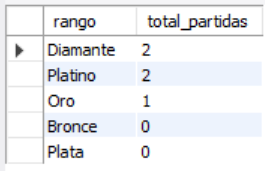

# Ejercicio Intermedio 001 - LEFT JOIN

**Camper:** Antonio Canux

## Descripción

Ejercicio de nivel intermedio enfocado en la creación de un módulo de datos para un ranking de Battle Royale. El objetivo es estructurar el almacenamiento de jugadores y partidas, y utilizar `LEFT JOIN` para consultar indicadores de rendimiento, incluyendo aquellos jugadores que aún no han participado en ninguna partida.

---

## Tablas utilizadas

**intermedio_ejercicio_001_jugadores**
- id (PK)
- nickname
- rango
- creado_en

**intermedio_ejercicio_001_partidas**
- id (PK)
- jugador_id (FK)
- posicion
- eliminaciones

---

## Consultas realizadas

### 1. ¿Cuál es el historial general de partidas por jugador (incluso si no tienen)?

```sql
SELECT j.nickname, j.rango, p.posicion, p.eliminaciones 
    FROM intermedio_ejercicio_001_jugadores 
    j LEFT JOIN intermedio_ejercicio_001_partidas 
    p ON j.id = p.jugador_id;
```

**Resultado**



---

### 2. ¿Cuál es el total de eliminaciones acumuladas por cada jugador?

```sql
SELECT j.nickname, COALESCE(SUM(p.eliminaciones), 0) AS total_eliminaciones 
    FROM intermedio_ejercicio_001_jugadores 
    j LEFT JOIN intermedio_ejercicio_001_partidas 
    p ON j.id = p.jugador_id GROUP BY j.id, j.nickname 
    ORDER BY total_eliminaciones DESC;
```

**Resultado**



---

### 3. ¿Qué jugadores registrados aún no han jugado ninguna partida?

```sql
SELECT j.nickname, j.rango 
    FROM intermedio_ejercicio_001_jugadores 
    j LEFT JOIN intermedio_ejercicio_001_partidas 
    p ON j.id = p.jugador_id 
    WHERE p.id IS NULL;
```

**Resultado**



---

### 4. ¿Cuál es la posición final promedio de los jugadores activos?

```sql
SELECT j.nickname, ROUND(AVG(p.posicion), 2) AS posicion_promedio 
    FROM intermedio_ejercicio_001_jugadores 
    j LEFT JOIN intermedio_ejercicio_001_partidas 
    p ON j.id = p.jugador_id 
    WHERE p.posicion IS NOT NULL 
    GROUP BY j.id, j.nickname 
    ORDER BY posicion_promedio ASC;
```

**Resultado**



---

### 5. ¿Cuántas partidas se han disputado distribuidas por rango de jugador?

```sql
SELECT j.rango, COUNT(p.id) AS total_partidas 
    FROM intermedio_ejercicio_001_jugadores 
    j LEFT JOIN intermedio_ejercicio_001_partidas 
    p ON j.id = p.jugador_id 
    GROUP BY j.rango 
    ORDER BY total_partidas DESC;
```

**Resultado**



---

## Herramientas

- MySQL
- MySQL Workbench
- Git
- GitHub

---

**Campuslands · Skill SQL**