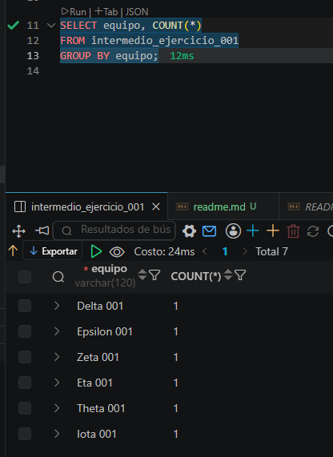
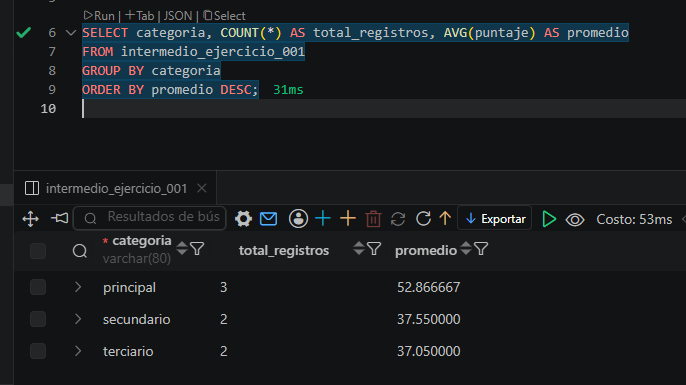

## Ejercicio 001 -Intermedio

## DESCRIPCION
Una academia tecnica esta construyendo un modulo de datos inspirado en torneo esports MOBA. El objetivo es guardar informacion ordenada, consultar indicadores utiles y dejar scripts SQL faciles de revisar por otro desarrollador.

## FLUJOS UTILIZADOS

```sql
CREATE DATABASE IF NOT EXISTS <NOMBRE>;

CREATE TABLE IF NOT EXISTS <NOMBRE>;

SELECT <CAMPO> FROM <TABLA>,
```


## EVIDENCIAS.


---

#

