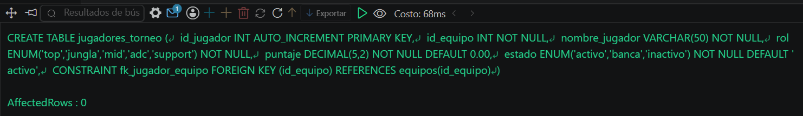
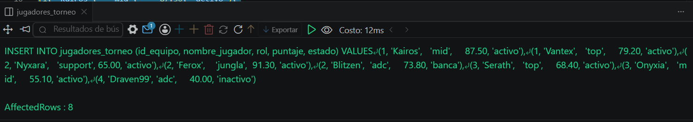
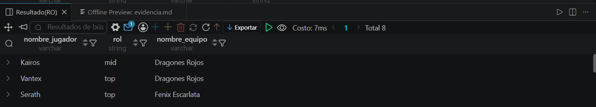

# Resolucion - Ejercicio 001 (Intermedio) - Selvin Lem

## Tematica
Torneo esports MOBA

## Como ejecutar
1. Ejecutar `ddl/schema.sql` para crear equipos y jugadores_torneo.
2. Ejecutar `dml/inserts.sql` para insertar 4 equipos y 8 jugadores.
3. Ejecutar `dql/consultas.sql` para correr las 5 consultas con INNER JOIN.

## Entidad principal
- Tablas: equipos (padre), jugadores_torneo (hija, FK a equipos)
- Atributos clave: nombre_equipo, nombre_jugador, id_equipo

## Restriccion aplicada
FOREIGN KEY id_equipo en jugadores_torneo, referenciando equipos(id_equipo).

## Caso limite incluido
Equipo retirado con un jugador inactivo asociado, para confirmar
que el INNER JOIN mantiene la relacion aunque el equipo no compita.

## Evidencia ejecucion - schema.sql

 

## Evidencia ejecucion - inserts.sql
 

## Evidencia ejecucion - consultas.sql
 