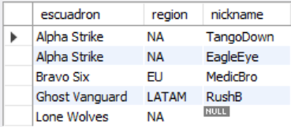
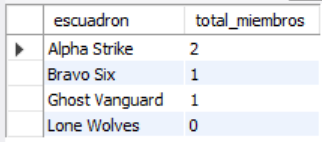
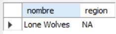
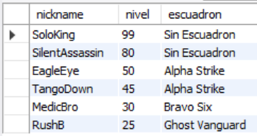
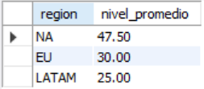

# Ejercicio Intermedio 002 - LEFT JOIN

**Camper:** Antonio Canux

## Descripción

Ejercicio de nivel intermedio enfocado en la creación de un módulo de datos para un ranking de Battle Royale, específicamente analizando la relación entre escuadrones (equipos) y jugadores. El objetivo es practicar `LEFT JOIN` para lidiar con datos asimétricos, como escuadrones sin miembros o jugadores que juegan en solitario.

---

## Tablas utilizadas

**intermedio_ejercicio_002_escuadrones**
- id (PK)
- nombre
- region
- creado_en

**intermedio_ejercicio_002_jugadores**
- id (PK)
- nickname
- nivel
- escuadron_id (FK)

---

## Consultas realizadas

### 1. ¿Cuál es el listado de todos los escuadrones y los nicknames de sus miembros (incluyendo vacíos)?

```sql
SELECT e.nombre AS escuadron, e.region, j.nickname 
    FROM intermedio_ejercicio_002_escuadrones 
    e LEFT JOIN intermedio_ejercicio_002_jugadores 
    j ON e.id = j.escuadron_id;
```

**Resultado**



---

### 2. ¿Cuál es el total de jugadores por escuadrón (mostrando 0 si está vacío)?

```sql
SELECT e.nombre AS escuadron, COUNT(j.id) AS total_miembros 
    FROM intermedio_ejercicio_002_escuadrones 
    e LEFT JOIN intermedio_ejercicio_002_jugadores 
    j ON e.id = j.escuadron_id 
    GROUP BY e.id, e.nombre 
    ORDER BY total_miembros DESC;
```

**Resultado**



---

### 3. ¿Qué escuadrones no tienen actualmente ningún jugador asignado?

```sql
SELECT e.nombre, e.region 
    FROM intermedio_ejercicio_002_escuadrones 
    e LEFT JOIN intermedio_ejercicio_002_jugadores 
    j ON e.id = j.escuadron_id 
    WHERE j.id IS NULL;
```

**Resultado**



---

### 4. ¿Cuál es el estado de todos los jugadores y su escuadrón (incluyendo los que juegan en solitario)?

```sql
SELECT j.nickname, j.nivel, COALESCE(e.nombre, 'Sin Escuadron') AS escuadron 
    FROM intermedio_ejercicio_002_jugadores 
    j LEFT JOIN intermedio_ejercicio_002_escuadrones 
    e ON j.escuadron_id = e.id 
    ORDER BY j.nivel DESC;
```

**Resultado**



---

### 5. ¿Cuál es el nivel promedio de los jugadores agrupados por la región de su escuadrón?

```sql
SELECT e.region, ROUND(AVG(j.nivel), 2) AS nivel_promedio 
    FROM intermedio_ejercicio_002_escuadrones 
    e LEFT JOIN intermedio_ejercicio_002_jugadores 
    j ON e.id = j.escuadron_id 
    WHERE j.nivel IS NOT NULL 
    GROUP BY e.region 
    ORDER BY nivel_promedio DESC;
```

**Resultado**



---

## Herramientas

- MySQL
- MySQL Workbench
- Git
- GitHub

---

**Campuslands · Skill SQL**