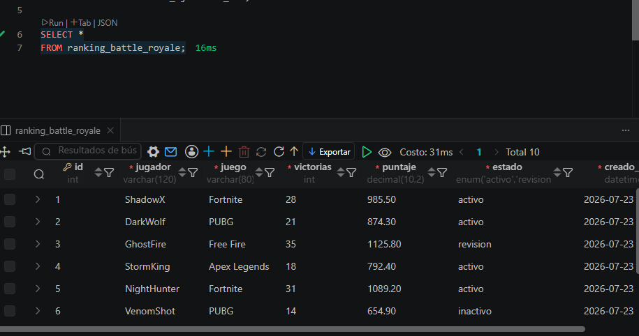
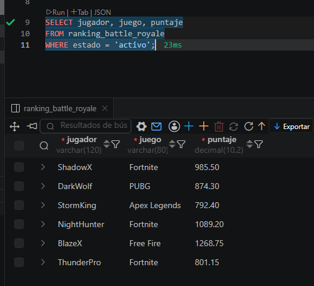

# 🎮 README - Ranking Battle Royale

## 📖 Descripción

En este ejercicio se desarrolló una base de datos básica para gestionar el **ranking de jugadores de videojuegos Battle Royale**.

Se creó una tabla que permite almacenar información de los jugadores, el juego en el que participan, la cantidad de victorias obtenidas, su puntaje acumulado y el estado de cada registro.

Posteriormente, se agregaron registros de ejemplo y se realizaron consultas SQL para aprender a recuperar y organizar la información almacenada.

---

# 🎯 Objetivos del ejercicio

- Aprender a crear tablas utilizando `CREATE TABLE`.
- Insertar información mediante `INSERT INTO`.
- Consultar registros con `SELECT`.
- Filtrar información utilizando `WHERE`.
- Ordenar resultados con `ORDER BY`.
- Limitar la cantidad de resultados mediante `LIMIT`.

---

# 🗄️ Información que almacena la tabla

La tabla **ranking_battle_royale** almacena información relacionada con los jugadores de un ranking competitivo.

Cada registro representa un jugador diferente.

Los datos almacenados son:

| Campo | Descripción |
|--------|-------------|
| **id** | Identificador único del jugador. |
| **jugador** | Nombre del jugador. |
| **juego** | Juego Battle Royale en el que participa. |
| **victorias** | Cantidad de partidas ganadas por el jugador. |
| **puntaje** | Puntaje acumulado dentro del ranking. |
| **estado** | Estado del registro (`activo`, `revision` o `inactivo`). |
| **creado_en** | Fecha y hora en que el registro fue creado automáticamente. |

---

# 📝 Actividades realizadas

Durante el desarrollo del ejercicio se realizaron las siguientes actividades:

## 1. Creación de la tabla

Se diseñó una tabla con los campos necesarios para almacenar información del ranking de jugadores.

Se utilizaron diferentes tipos de datos como:

- INT
- VARCHAR
- DECIMAL
- ENUM
- DATETIME

También se implementaron restricciones como:

- PRIMARY KEY
- AUTO_INCREMENT
- NOT NULL
- DEFAULT

---

## 2. Inserción de registros

Se agregaron **10 jugadores** pertenecientes a distintos videojuegos Battle Royale.

Cada registro incluye:

- Nombre del jugador
- Juego
- Cantidad de victorias
- Puntaje
- Estado del registro

---

## 3. Consultas SQL

Se desarrollaron consultas para practicar operaciones básicas como:

- Mostrar todos los registros.
- Filtrar jugadores activos.
- Buscar jugadores con más de cierta cantidad de victorias.
- Ordenar el ranking por puntaje.
- Mostrar únicamente los mejores jugadores.

---

# 📚 Conceptos aplicados

Durante este ejercicio se utilizaron los siguientes comandos SQL:

- `CREATE TABLE`
- `INSERT INTO`
- `SELECT`
- `WHERE`
- `ORDER BY`
- `LIMIT`

---

# ✅ Resultado esperado

Al finalizar el ejercicio se obtiene una tabla completamente funcional que permite almacenar información de un ranking de jugadores Battle Royale.

La información puede ser consultada, organizada y filtrada mediante diferentes instrucciones SQL, facilitando el análisis de los datos.

---

# 🎓 Competencias desarrolladas

Al completar este ejercicio el estudiante será capaz de:

- Diseñar tablas en una base de datos.
- Seleccionar tipos de datos adecuados.
- Insertar registros correctamente.
- Realizar consultas básicas.
- Filtrar información utilizando condiciones.
- Ordenar registros según un criterio.
- Comprender la estructura básica de una base de datos relacional.

---

# 🚀 Conclusión

Este ejercicio introduce los fundamentos del manejo de datos en SQL utilizando un escenario de videojuegos Battle Royale. A través de la creación de la tabla, la inserción de registros y la ejecución de consultas, se fortalecen las bases necesarias para desarrollar aplicaciones que gestionen información de manera organizada y eficiente.

## anexos

# 

