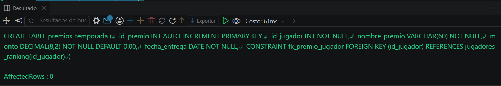
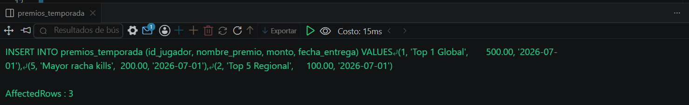
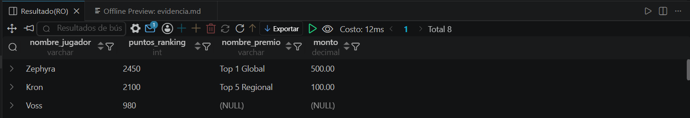

# Resolucion - Ejercicio 002 (Intermedio) - Selvin Lem

## Tematica
Ranking battle royale

## Como ejecutar
1. Ejecutar `ddl/schema.sql` para crear jugadores_ranking y premios_temporada.
2. Ejecutar `dml/inserts.sql` para insertar 8 jugadores y 3 premios.
3. Ejecutar `dql/consultas.sql` para correr las 5 consultas con LEFT JOIN.

## Entidad principal
- Tablas: jugadores_ranking (izquierda), premios_temporada (derecha, FK)
- Atributos clave: nombre_jugador, puntos_ranking, nombre_premio

## Restriccion aplicada
FOREIGN KEY id_jugador en premios_temporada, referenciando jugadores_ranking.

## Caso limite incluido
5 de 8 jugadores no tienen premio asociado, para demostrar que LEFT JOIN
los conserva con NULL en vez de descartarlos como haria INNER JOIN.

## Evidencia ejecucion - schema.sql

 

## Evidencia ejecucion - inserts.sql
 

## Evidencia ejecucion - consultas.sql
 