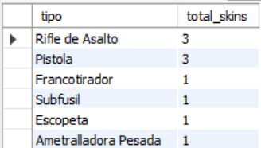
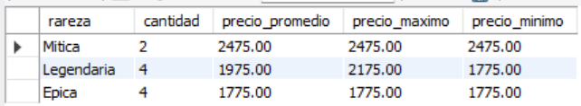
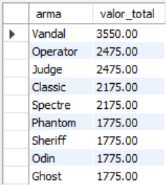
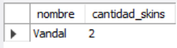
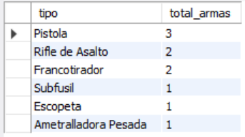

# Ejercicio Intermedio 003 - GROUP BY

**Camper:** Antonio Canux

## Descripción

Ejercicio de nivel intermedio enfocado en la creación de un módulo de datos para un inventario de skins de un juego shooter. Se estructuró la base de datos dividiendo las armas base y sus respectivas skins. El objetivo principal es practicar la cláusula `GROUP BY` y funciones de agregación para obtener indicadores de negocio precisos, asegurando 10 registros de inserción por tabla.

---

## Tablas utilizadas

**intermedio_ejercicio_003_armas**
- id (PK)
- nombre
- tipo
- creado_en

**intermedio_ejercicio_003_skins**
- id (PK)
- arma_id (FK)
- nombre_skin
- rareza
- precio

---

## Consultas realizadas

### 1. ¿Cuántas skins disponibles hay por cada tipo de arma?

```sql
SELECT a.tipo, COUNT(s.id) AS total_skins 
    FROM intermedio_ejercicio_003_armas 
    a JOIN intermedio_ejercicio_003_skins 
    s ON a.id = s.arma_id 
    GROUP BY a.tipo 
    ORDER BY total_skins DESC;
```

**Resultado**



---

### 2. ¿Cuál es el precio promedio, máximo y mínimo de las skins agrupadas por rareza?

```sql
SELECT rareza, COUNT(id) AS cantidad, ROUND(AVG(precio), 2) AS precio_promedio, MAX(precio) AS precio_maximo, MIN(precio) AS precio_minimo 
    FROM intermedio_ejercicio_003_skins 
    GROUP BY rareza 
    ORDER BY precio_promedio DESC;
```

**Resultado**



---

### 3. ¿Cuál es el valor total del inventario acumulado por cada arma específica?

```sql
SELECT a.nombre AS arma, SUM(s.precio) AS valor_total 
    FROM intermedio_ejercicio_003_armas 
    a JOIN intermedio_ejercicio_003_skins 
    s ON a.id = s.arma_id 
    GROUP BY a.id, a.nombre 
    ORDER BY valor_total DESC;
```

**Resultado**



---

### 4. ¿Qué armas tienen más de 1 skin registrada en el inventario?

```sql
SELECT a.nombre, COUNT(s.id) AS cantidad_skins 
    FROM intermedio_ejercicio_003_armas 
    a JOIN intermedio_ejercicio_003_skins 
    s ON a.id = s.arma_id 
    GROUP BY a.id, a.nombre
    HAVING cantidad_skins > 1;
```

**Resultado**



---

### 5. ¿Cuántas armas base distintas están registradas en el sistema por categoría (tipo)?

```sql
SELECT tipo, COUNT(id) AS total_armas 
    FROM intermedio_ejercicio_003_armas 
    GROUP BY tipo 
    ORDER BY total_armas DESC;
```

**Resultado**



---

## Herramientas

- MySQL
- MySQL Workbench
- Git
- GitHub

---

**Campuslands · Skill SQL**