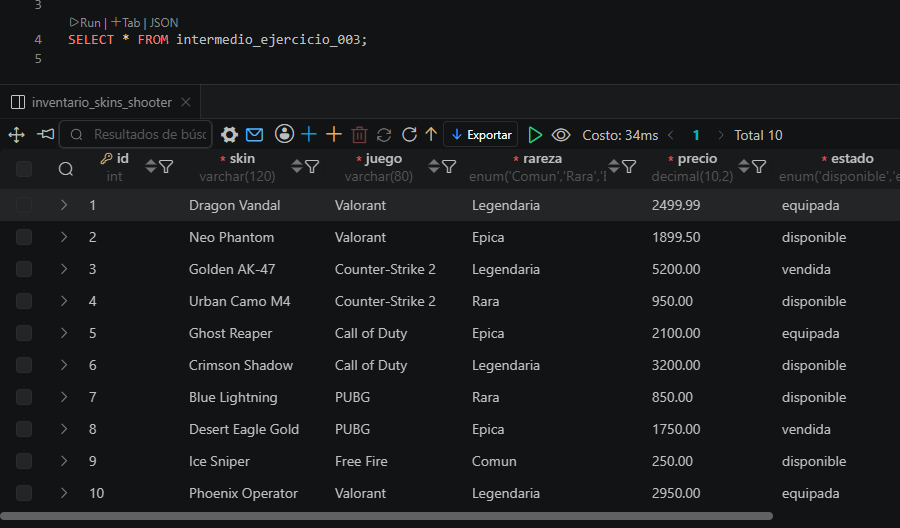
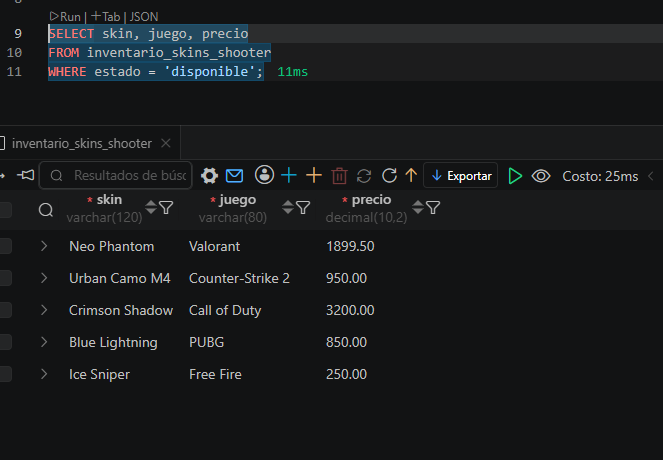

# 🎯 Inventario de Skins Shooter

## 📖 Descripción

En este ejercicio se desarrolló una base de datos para administrar un **inventario de skins de videojuegos Shooter**.

La base de datos permite registrar información de diferentes skins pertenecientes a juegos como Valorant, Counter-Strike 2, Call of Duty, PUBG y Free Fire.

Además de almacenar los datos, se realizaron consultas para aprender a recuperar, filtrar y ordenar la información utilizando SQL.

---

# 🎯 Objetivos

- Crear una tabla mediante `CREATE TABLE`.
- Registrar información utilizando `INSERT INTO`.
- Consultar registros con `SELECT`.
- Filtrar datos usando `WHERE`.
- Ordenar resultados mediante `ORDER BY`.
- Limitar resultados con `LIMIT`.

---

# 🗄 Información almacenada

La tabla **inventario_skins_shooter** almacena la siguiente información:

| Campo | Descripción |
|--------|-------------|
| **id** | Identificador único de la skin. |
| **skin** | Nombre de la skin. |
| **juego** | Juego al que pertenece la skin. |
| **rareza** | Nivel de rareza (Común, Rara, Épica o Legendaria). |
| **precio** | Valor de la skin. |
| **estado** | Estado actual de la skin (Disponible, Equipada o Vendida). |
| **creado_en** | Fecha y hora de creación del registro. |

---

# 📝 Actividades realizadas

## 1. Creación de la tabla

Se diseñó una estructura con tipos de datos adecuados y restricciones como:

- PRIMARY KEY
- AUTO_INCREMENT
- NOT NULL
- DEFAULT
- ENUM

---

## 2. Inserción de datos

Se registraron **10 skins** pertenecientes a distintos videojuegos Shooter.

Cada registro almacena:

- Nombre de la skin
- Juego
- Rareza
- Precio
- Estado

---

## 3. Consultas realizadas

Se implementaron consultas para:

- Mostrar todas las skins.
- Consultar únicamente las disponibles.
- Filtrar skins legendarias.
- Ordenar por precio.
- Mostrar las cinco skins más costosas.

---

# 📚 Comandos SQL utilizados

- CREATE TABLE
- INSERT INTO
- SELECT
- WHERE
- ORDER BY
- LIMIT

---

# ✅ Resultado esperado

Al finalizar el ejercicio se obtiene un inventario organizado de skins que puede consultarse y administrarse mediante sentencias SQL.

---

# 🎓 Competencias desarrolladas

El estudiante aprenderá a:

- Diseñar tablas.
- Insertar registros.
- Consultar información.
- Aplicar filtros.
- Ordenar resultados.
- Administrar inventarios básicos utilizando SQL.

---

# 🚀 Conclusión

Este ejercicio permite practicar los fundamentos de SQL mediante un escenario relacionado con videojuegos Shooter. El estudiante comprende cómo crear una estructura de datos, almacenar información y realizar consultas para obtener resultados útiles y organizados.

## EVIDENDCIAS.

