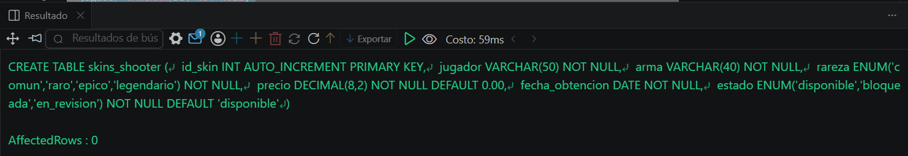
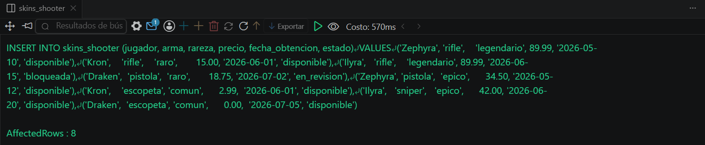
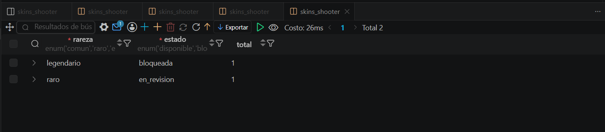

# Resolucion - Ejercicio 003 (Intermedio) - Selvin Lem

## Tematica
Inventario de skins shooter

## Como ejecutar
1. Ejecutar `ddl/schema.sql` para crear skins_shooter.
2. Ejecutar `dml/inserts.sql` para insertar 8 registros de prueba.
3. Ejecutar `dql/consultas.sql` para correr las 5 consultas con GROUP BY.

## Entidad principal
- Tabla: skins_shooter
- Atributos clave: jugador, arma, rareza, precio

## Restriccion aplicada
ENUM en rareza y estado, restringiendo valores validos.

## Caso limite incluido
Skin con precio en 0.00 (sin tasar aun), incluida en los grupos
para confirmar que SUM/AVG no se distorsionan con el valor extremo.

## Evidencia ejecucion - schema.sql

 

## Evidencia ejecucion - inserts.sql
 

## Evidencia ejecucion - consultas.sql
 