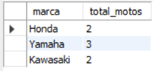
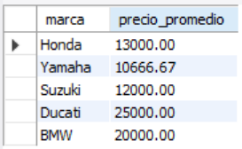
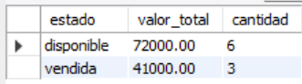
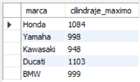
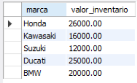

# Ejercicio Intermedio 004 - HAVING

**Camper:** Antonio Canux

## Descripción

Ejercicio de nivel intermedio enfocado en la creación de un módulo de datos para un garaje de motos. Se estructuró la base de datos separando las marcas y los vehículos (motocicletas). El objetivo principal es practicar la cláusula `HAVING` en conjunto con `GROUP BY` para filtrar resultados agregados, insertando 10 registros por tabla.

---

## Tablas utilizadas

**intermedio_ejercicio_004_marcas**
- id (PK)
- nombre
- pais_origen
- creado_en

**intermedio_ejercicio_004_motos**
- id (PK)
- marca_id (FK)
- modelo
- cilindraje
- precio
- estado

---

## Consultas realizadas

### 1. ¿Qué marcas tienen más de 1 motocicleta registrada en el garaje?

```sql
SELECT m.nombre AS marca, COUNT(v.id) AS total_motos 
    FROM intermedio_ejercicio_004_marcas 
    m JOIN intermedio_ejercicio_004_motos 
    v ON m.id = v.marca_id 
    GROUP BY m.id, m.nombre 
    HAVING total_motos > 1;
```

**Resultado**



---

### 2. ¿Cuáles marcas tienen un precio promedio de motocicletas superior a 10,000?

```sql
SELECT m.nombre AS marca, ROUND(AVG(v.precio), 2) AS precio_promedio 
    FROM intermedio_ejercicio_004_marcas 
    m JOIN intermedio_ejercicio_004_motos 
    v ON m.id = v.marca_id 
    GROUP BY m.id, m.nombre 
    HAVING precio_promedio > 10000;
```

**Resultado**



---

### 3. ¿Qué estados del inventario agrupan un valor total superior a 20,000?

```sql
SELECT estado, SUM(precio) AS valor_total, COUNT(id) AS cantidad 
    FROM intermedio_ejercicio_004_motos 
    GROUP BY estado 
    HAVING valor_total > 20000;
```

**Resultado**



---

### 4. ¿Qué marcas ofrecen motocicletas con un cilindraje máximo igual o superior a 900cc?

```sql
SELECT m.nombre AS marca, MAX(v.cilindraje) AS cilindraje_maximo 
    FROM intermedio_ejercicio_004_marcas 
    m JOIN intermedio_ejercicio_004_motos 
    v ON m.id = v.marca_id 
    GROUP BY m.id, m.nombre 
    HAVING cilindraje_maximo >= 900;
```

**Resultado**



---

### 5. ¿Qué marcas poseen un valor de inventario acumulado que se encuentre entre 10,000 y 30,000?

```sql
SELECT m.nombre AS marca, SUM(v.precio) AS valor_inventario 
    FROM intermedio_ejercicio_004_marcas 
    m JOIN intermedio_ejercicio_004_motos 
    v ON m.id = v.marca_id 
    GROUP BY m.id, m.nombre 
    HAVING valor_inventario 
    BETWEEN 10000 AND 30000;
```

**Resultado**



---

## Herramientas

- MySQL
- MySQL Workbench
- Git
- GitHub

---

**Campuslands · Skill SQL**