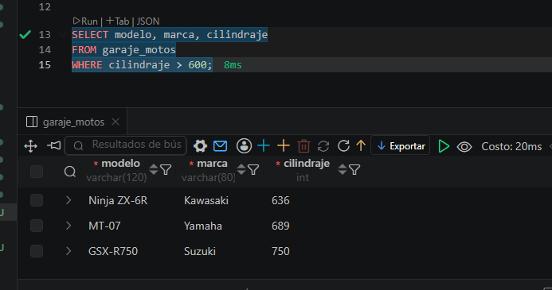

# 🏍️ Garaje de Motos

## 📖 Descripción

En este ejercicio se creó una base de datos para administrar un **garaje de motocicletas**. La tabla permite registrar información de diferentes motos, incluyendo su modelo, marca, cilindraje, precio y estado actual.

Después de crear la tabla, se insertaron diez registros de ejemplo y se realizaron consultas SQL para practicar la recuperación, el filtrado y el ordenamiento de la información.

---

# 🎯 Objetivos

- Crear una tabla utilizando `CREATE TABLE`.
- Insertar registros mediante `INSERT INTO`.
- Consultar información con `SELECT`.
- Filtrar datos usando `WHERE`.
- Ordenar resultados mediante `ORDER BY`.
- Limitar resultados utilizando `LIMIT`.

---

# 🗄️ Información almacenada

La tabla **garaje_motos** almacena la siguiente información:

| Campo | Descripción |
|--------|-------------|
| **id** | Identificador único de la motocicleta. |
| **modelo** | Modelo de la motocicleta. |
| **marca** | Fabricante de la motocicleta. |
| **cilindraje** | Cilindraje del motor expresado en centímetros cúbicos (cc). |
| **precio** | Precio de venta de la motocicleta. |
| **estado** | Estado actual de la motocicleta (`disponible`, `mantenimiento` o `vendida`). |
| **creado_en** | Fecha y hora en que se registró la motocicleta. |

---

# 📝 Actividades realizadas

## 1. Creación de la tabla

Se definió la estructura de la tabla utilizando tipos de datos como:

- INT
- VARCHAR
- DECIMAL
- ENUM
- DATETIME

También se aplicaron restricciones como:

- PRIMARY KEY
- AUTO_INCREMENT
- NOT NULL
- DEFAULT

---

## 2. Inserción de datos

Se registraron **10 motocicletas** de diferentes marcas, incluyendo Honda, Yamaha, Kawasaki, KTM, Suzuki, Ducati, BMW, Bajaj y TVS.

Cada registro contiene:

- Modelo
- Marca
- Cilindraje
- Precio
- Estado

---

## 3. Consultas realizadas

Se desarrollaron consultas para:

- Mostrar todas las motocicletas.
- Consultar únicamente las disponibles.
- Filtrar motos con cilindraje superior a 600 cc.
- Ordenar por precio de mayor a menor.
- Mostrar las cinco motocicletas más costosas.

---

# 📚 Comandos SQL utilizados

- `CREATE TABLE`
- `INSERT INTO`
- `SELECT`
- `WHERE`
- `ORDER BY`
- `LIMIT`

---

# ✅ Resultado esperado

Al finalizar el ejercicio se obtiene una tabla funcional que permite administrar un garaje de motocicletas y consultar la información de distintas maneras mediante SQL.

---

# 🎓 Competencias desarrolladas

Al completar este ejercicio el estudiante será capaz de:

- Diseñar tablas relacionales.
- Insertar registros correctamente.
- Consultar información almacenada.
- Aplicar filtros mediante condiciones.
- Ordenar resultados.
- Gestionar inventarios básicos utilizando SQL.

---

# 🚀 Conclusión

Este ejercicio fortalece los conocimientos básicos de SQL mediante un caso práctico de administración de un garaje de motocicletas. El estudiante aprende a estructurar una base de datos, registrar información y realizar consultas para obtener datos relevantes de forma organizada y eficiente.

## EVIDENCIA.

