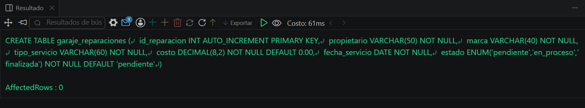
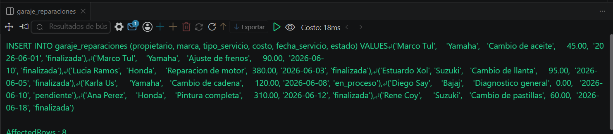
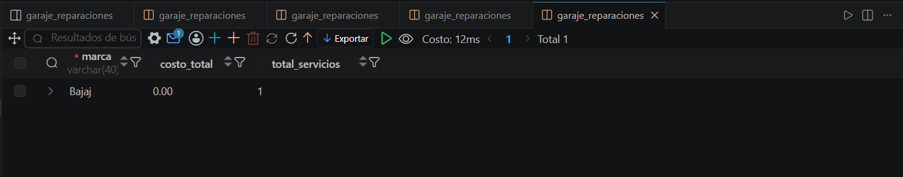

# Resolucion - Ejercicio 004 (Intermedio) - Selvin Lem

## Tematica
Garaje de motos

## Como ejecutar
1. Ejecutar `ddl/schema.sql` para crear garaje_reparaciones.
2. Ejecutar `dml/inserts.sql` para insertar 8 registros de prueba.
3. Ejecutar `dql/consultas.sql` para correr las 5 consultas con HAVING.

## Entidad principal
- Tabla: garaje_reparaciones
- Atributos clave: propietario, marca, costo, estado

## Restriccion aplicada
ENUM en estado, restringido al ciclo de vida de una reparacion.

## Caso limite incluido
Servicio en Bajaj con costo en 0.00 (diagnostico sin cotizar), usado
para verificar que HAVING tambien filtra grupos con valores bajos.

## Evidencia ejecucion - schema.sql

 

## Evidencia ejecucion - inserts.sql
 

## Evidencia ejecucion - consultas.sql
 