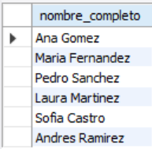
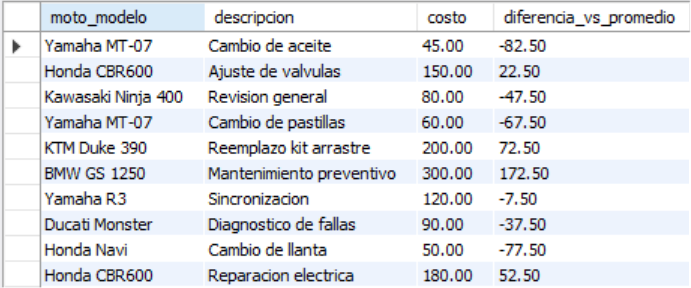
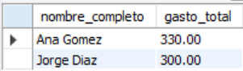

# Ejercicio Intermedio 005 - Subconsultas

**Camper:** Antonio Canux

## Descripción

Último ejercicio de nivel intermedio, centrado en la creación de un módulo de datos para un taller mecánico de motos. La base de datos relaciona a los clientes con sus respectivas reparaciones. El objetivo de esta práctica es aplicar **subconsultas** en diferentes cláusulas (`WHERE`, `SELECT`, `FROM`) para extraer indicadores avanzados de negocio, garantizando la inserción de 10 registros por tabla.

---

## Tablas utilizadas

**intermedio_ejercicio_005_clientes**
- id (PK)
- nombre_completo
- telefono
- creado_en

**intermedio_ejercicio_005_reparaciones**
- id (PK)
- cliente_id (FK)
- moto_modelo
- descripcion
- costo
- estado

---

## Consultas realizadas

### 1. ¿Qué clientes tienen reparaciones cuyo costo es superior al promedio general del taller?

```sql
SELECT nombre_completo, telefono 
    FROM intermedio_ejercicio_005_clientes 
    WHERE id IN (SELECT cliente_id 
        FROM intermedio_ejercicio_005_reparaciones 
        WHERE costo > (SELECT AVG(costo) 
            FROM intermedio_ejercicio_005_reparaciones));
```

**Resultado**


---

### 2. ¿Cuáles son los detalles y el cliente de la reparación más costosa registrada?

```sql
SELECT r.moto_modelo, r.descripcion, r.costo, c.nombre_completo 
    FROM intermedio_ejercicio_005_reparaciones 
    r JOIN intermedio_ejercicio_005_clientes 
    c ON r.cliente_id = c.id 
    WHERE r.costo = (SELECT MAX(costo) 
        FROM intermedio_ejercicio_005_reparaciones);
```

**Resultado**


---

### 3. ¿Qué clientes NO tienen actualmente ninguna reparación en estado 'pendiente'?

```sql
SELECT nombre_completo 
    FROM intermedio_ejercicio_005_clientes 
    WHERE id NOT IN (SELECT cliente_id 
        FROM intermedio_ejercicio_005_reparaciones 
        WHERE estado = 'pendiente');
```

**Resultado**



---

### 4. ¿Cuál es la diferencia de costo de cada reparación respecto al promedio general?

```sql
SELECT moto_modelo, descripcion, costo, ROUND(costo - (SELECT AVG(costo) 
    FROM intermedio_ejercicio_005_reparaciones), 2) AS diferencia_vs_promedio 
    FROM intermedio_ejercicio_005_reparaciones;
```

**Resultado**



---

### 5. ¿Qué clientes han realizado un gasto total en reparaciones superior a 200?

```sql
SELECT c.nombre_completo, totales.gasto_total 
    FROM intermedio_ejercicio_005_clientes 
    c JOIN (SELECT cliente_id, SUM(costo) AS gasto_total 
    FROM intermedio_ejercicio_005_reparaciones 
    GROUP BY cliente_id) AS totales ON c.id = totales.cliente_id 
    WHERE totales.gasto_total > 200;
```

**Resultado**



---

## Herramientas

- MySQL
- MySQL Workbench
- Git
- GitHub

---

**Campuslands · Skill SQL**