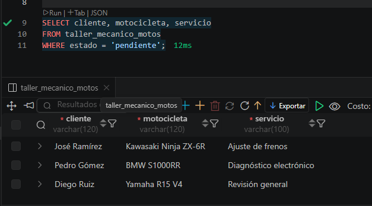

# 🔧 Taller Mecánico de Motos

## 📖 Descripción

En este ejercicio se desarrolló una base de datos para administrar las órdenes de servicio de un **taller mecánico de motocicletas**.

La tabla almacena información de los clientes, las motocicletas que ingresan al taller, el tipo de servicio realizado, el costo del trabajo y el estado de la reparación.

Además, se registraron diez órdenes de servicio y se realizaron consultas SQL para practicar la administración y consulta de los datos.

---

# 🎯 Objetivos

- Crear una tabla mediante `CREATE TABLE`.
- Registrar información utilizando `INSERT INTO`.
- Consultar datos con `SELECT`.
- Filtrar registros utilizando `WHERE`.
- Ordenar resultados con `ORDER BY`.
- Limitar resultados mediante `LIMIT`.

---

# 🗄️ Información almacenada

La tabla **taller_mecanico_motos** almacena la siguiente información:

| Campo | Descripción |
|--------|-------------|
| **id** | Identificador único de la orden de servicio. |
| **cliente** | Nombre del propietario de la motocicleta. |
| **motocicleta** | Modelo de la motocicleta ingresada al taller. |
| **servicio** | Tipo de mantenimiento o reparación realizada. |
| **costo** | Valor del servicio realizado. |
| **estado** | Estado de la orden (`pendiente`, `en_proceso` o `finalizado`). |
| **creado_en** | Fecha y hora en que se registró la orden. |

---

# 📝 Actividades realizadas

## 1. Creación de la tabla

Se diseñó una tabla con los campos necesarios para registrar las órdenes de servicio de un taller mecánico.

Se utilizaron los tipos de datos:

- INT
- VARCHAR
- DECIMAL
- ENUM
- DATETIME

También se implementaron restricciones como:

- PRIMARY KEY
- AUTO_INCREMENT
- NOT NULL
- DEFAULT

---

## 2. Inserción de datos

Se registraron **10 órdenes de servicio** correspondientes a distintos clientes y motocicletas.

Cada registro incluye:

- Cliente
- Motocicleta
- Servicio realizado
- Costo
- Estado de la orden

---

## 3. Consultas SQL

Se desarrollaron consultas para:

- Mostrar todas las órdenes de servicio.
- Consultar únicamente los servicios pendientes.
- Filtrar servicios con costo superior a un valor determinado.
- Ordenar los servicios por costo.
- Mostrar las cinco órdenes de mayor costo.

---

# 📚 Comandos SQL utilizados

- `CREATE TABLE`
- `INSERT INTO`
- `SELECT`
- `WHERE`
- `ORDER BY`
- `LIMIT`

---

# ✅ Resultado esperado

Al finalizar el ejercicio se obtiene una base de datos capaz de administrar las órdenes de servicio de un taller mecánico de motocicletas, permitiendo consultar y organizar la información de manera eficiente.

---

# 🎓 Competencias desarrolladas

Con este ejercicio el estudiante aprenderá a:

- Diseñar tablas relacionales.
- Insertar registros.
- Consultar información.
- Filtrar datos mediante condiciones.
- Ordenar resultados.
- Gestionar órdenes de servicio utilizando SQL.

---

# 🚀 Conclusión

Este ejercicio permite aplicar los fundamentos de SQL en un contexto de un taller mecánico de motocicletas. A través de la creación de la tabla, el registro de órdenes y la ejecución de consultas, se fortalecen las habilidades para administrar información en bases de datos relacionales.

## EVIDENCIA
