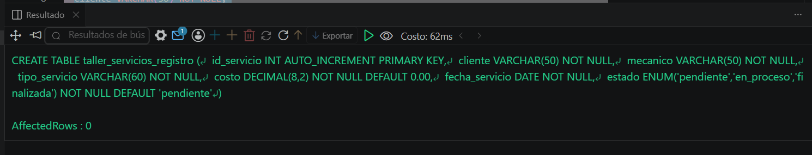
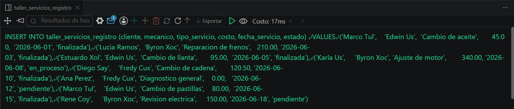
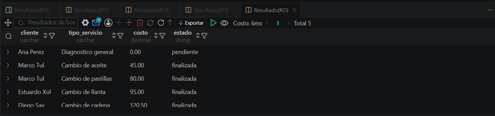

# Resolucion - Ejercicio 005 (Intermedio) - Selvin Lem

## Tematica
Taller mecanico de motos

## Como ejecutar
1. Ejecutar `ddl/schema.sql` para crear taller_servicios_registro.
2. Ejecutar `dml/inserts.sql` para insertar 8 registros de prueba.
3. Ejecutar `dql/consultas.sql` para correr las 5 consultas con subconsultas.

## Entidad principal
- Tabla: taller_servicios_registro
- Atributos clave: cliente, mecanico, costo, estado

## Restriccion aplicada
ENUM en estado, restringido al ciclo de vida de un servicio.

## Caso limite incluido
Servicio con costo en 0.00, usado para validar el limite inferior
al comparar contra promedios calculados con subconsultas.

## Evidencia ejecucion - schema.sql
 

## Evidencia ejecucion - inserts.sql
 

## Evidencia ejecucion - consultas.sql
 